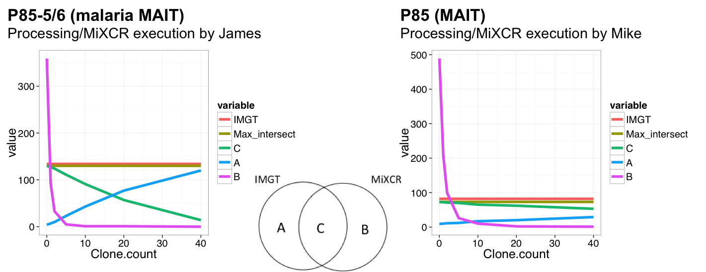
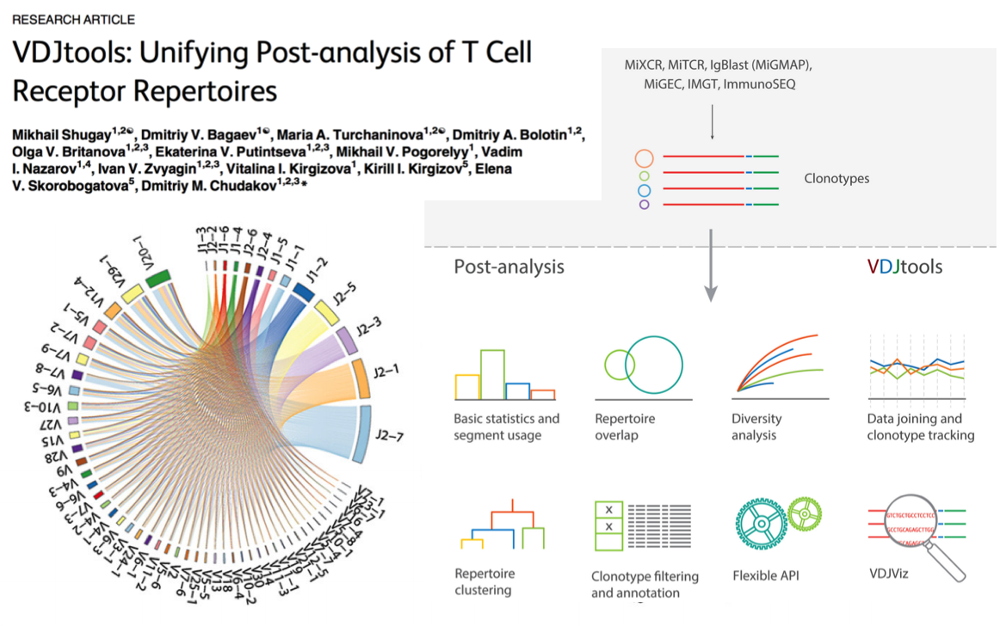

`r opts_chunk$set(echo=FALSE, message=FALSE, comment="")`

<!-- Limit image width and height -->
<style type="text/css">
img {     
  max-height: 500px;     
  max-width: 800px; 
}
</style>
 
<!-- Center image on slide -->
<script type="text/javascript" src="http://ajax.aspnetcdn.com/ajax/jQuery/jquery-1.7.min.js"></script>
<script type="text/javascript">
$(function() {     
  $("p:has(img)").addClass('centered'); 
});
</script>

<!-- Fix markdown emphasis -->
<style>
strong {
  font-weight: bold;
}
em {
  font-style: italic
}
</style>

```{r load_libs, cache=FALSE}
library(knitr)
library(readr)
library(reshape2)
library(ggplot2)
library(cowplot)
library(dplyr)
library(stringr)
library(tidyr)
library(rCharts)
```

--- 

## What the heck is this?

<br>
<br>

### `slidify`: presentations made in `R` using Rmarkdown!

> + share code in the same place as text
> + evaluate `R` commands & include outputs in slides
> + include images & other customizations as needed
> + host as HTML on **GitHub**

--- 

## From single cells to clonotypes
#### TCR-sequencing at BRI
<br>

 

---  

## TCR-seq: quantification & clonotype identification 
#### C1 RNA-seq Galaxy workflow developed by Mike Mason et al.
<br>


---  

## MiXCR for clonotype identification & quantification
#### Avoiding the IMGT bottleneck
<br>

> * Very fast, accurate alignment of reads to CDR3 (and other T-, B-cell 
features)  
> * Runs locally, without need for **Trinity** transcriptome assembly
> * Found, implemented, & tested by Mike
> * Produced very similar results to **IMGT V-QUEST** in initial testing (later,
we encountered some discrepancies related to input data)

---  

## Plugging in MiXCR
#### Potential modifications to improve pipeline performance & reliability
<br>


---  

## Investigating discrepancies with MiXCR
#### Variation in MiXCR output & overlap with IMGT
<br>

> * Looking at MiXCR results from different projects, Peter observed dropoff
in number of functional junctions identified
> * By extension, more recent projects also showed worse overlap with IMGT
> * Overlap in these cases appears highly dependent on cutoff used for
`clone count` metric
> * For some of the problematic projects, MiXCR was run by me instead of Mike
> * Projects were also processed in **Galaxy** at different times

---  

## Taking a closer look at P85
#### Exploring MiXCR results with MAIT cells
<br>



---

## Working with clonotype data in `R`
#### New code to save time/effort for testing & analysis
<br>


---  
`r opts_knit$set(root.dir = "/Users/jaeddy/code/github/projects/tcrSeqAnalysis/")`

## Working with clonotype data in `R`
#### Combining MiXCR outputs

```{r, echo=TRUE, cache=FALSE}
source("R/prep_junctions.R")
```

```{r, echo=TRUE}
mixcr_folder <- "data/P85/P85_MAIT/mixcrOutput_MM"
project <- "P85"
out_folder <- mixcr_folder

# combine MiXCR junctions into a single file
mixcr_file <- combine_mixcr_outputs(mixcr_folder, out_folder, project)
```

---

## Working with clonotype data in `R`
#### Reading & formatting MiXCR outputs

```{r echo=TRUE}
mixcr <- format_mixcr_jxns(mixcr_file) %>% # read, format junctions
    filter_mixcr_jxns() %>% # remove non-functional, aa length < 7
    list(jxns = .) # store in list object
```

`mixcr$jxns`
```{r}
head(mixcr$jxns, 5) %>% kable()
```

--- 

## Working with clonotype data in `R`
#### Visually inspecting MiXCR junction data
<br>

`plot_mixcr_jxn_dist()` & `plot_mixcr_summary()`
```{r, cache=FALSE, fig.width=10, fig.height=6}
source("R/plot_junction_stats.R")
p1 <- plot_mixcr_jxn_dist(mixcr$jxns, cutoff_line = 20)
p2 <- plot_mixcr_summary(mixcr$jxns)
plot_grid(p1, p2, nrow = 2)
```

--- 

## Working with clonotype data in `R`
#### Reading & formatting IMGT outputs

```{r echo=TRUE}
imgt_file <- "data/P85/P85_MAIT/complied_P85_Prilic_1_and_2_productive_trimmed_unique.txt"

imgt <- format_imgt_jxns(imgt_file) %>% # read and filter IMGT junctions
    filter_imgt_jxns() %>% # remove non-functional, aa length < 7
    filter(!str_detect(lib_id, "lib2.*")) %>% # remove older samples
    list(jxns = .) # store in list object
```

`imgt$jxns`
```{r}
head(imgt$jxns, 5) %>% kable()
```

--- 

## Working with clonotype data in `R`
#### Inspecting IMGT & MiXCR junction overlap
<br>

```{r, fig.align='center', fig.width=10, fig.height=6}
p1 <- compare_jxn_dists(imgt$jxns, mixcr$jxns) %>% 
    plot_jxn_comp()
p1
```

--- 

## Investigating discrepancies with MiXCR
#### Checking for user variability with P85
<br>

```{r, fig.align='center', fig.width=12, fig.height=6, warning=FALSE}
mixcr_folder <- "data/P85/P85_MAIT/mixcrOutput_JE"
project <- "P85"
out_folder <- mixcr_folder

# Combine MiXCR junctions into a single file; read, format, and filter junctions
mixcr_je <- 
    combine_mixcr_outputs(mixcr_folder, out_folder, project) %>% 
    format_mixcr_jxns() %>% 
    filter_mixcr_jxns() %>% 
    list(jxns = .)

p2 <- compare_jxn_dists(imgt$jxns, mixcr_je$jxns) %>% 
    plot_jxn_comp()
plot_grid(p1, p2, labels = c("Processing & MiXCR execution by Mike",
                             "Processing by Mike, MiXCR execution by James"))
```

--- 

## Investigating discrepancies with MiXCR
#### Checking the effect of RNA-seq parameters
<br>

+ **Read trimming:** adapter trimming, 3' end trimming, quality trimming  
+ **Duplicate removal:** yes or no
+ **Read length:** 100bp (long) vs. 58bp (short)

**Testing:** used RNA-seq data from flowcell C4WYJACXX (8/12/2014): 100bp reads

+ selected 20 samples  
+ manually simulated shorter reads for same set of samples  
+ varied other parameters (updated Mike's code for running MiXCR to include
options for read trimming, duplicate filtering, etc. - independent of Galaxy)
+ ran both MiXCR & IMGT (bonus function: `compile_imgt_output()`)  

```{r}
project <- "P85"

# Read and format IMGT outputs

# 1) 100bp reads
summary_file <- "data/P85/P85_100/imgtOutput/1_Summary.txt"
out_folder <- dirname(summary_file)
        
# Compile and format IMGT junctions; read and filter junctions
p85_100_imgt <- 
    compile_imgt_output(summary_file, out_folder, project) %>% 
    format_imgt_jxns() %>% 
    filter_imgt_jxns() %>% 
    list(jxns = .)

# 1) 58bp reads
summary_file <- "data/P85/P85_58/imgtOutput/1_Summary.txt"
out_folder <- dirname(summary_file)
        
# Compile and format IMGT junctions; read and filter junctions
p85_58_imgt <- 
    compile_imgt_output(summary_file, out_folder, project) %>% 
    format_imgt_jxns() %>% 
    filter_imgt_jxns() %>% 
    list(jxns = .)
```

```{r}
# Read and format MiXCR outputs

# 1) 100 bp reads, duplicates removed
mixcr_folder <- "data/P85/P85_100/mixcrOutput_rmDups/"
out_folder <- mixcr_folder

# combine MiXCR junctions into single file; read, format, and filter junctions
p85_100_mixcr <- 
    combine_mixcr_outputs(mixcr_folder, out_folder, project) %>% 
    format_mixcr_jxns() %>% 
    filter_mixcr_jxns() %>% 
    list(jxns = .)

# 2) 58 bp reads, duplicates removed
mixcr_folder <- "data/P85/P85_58/mixcrOutput_rmDups/"
out_folder <- mixcr_folder

# combine MiXCR junctions into single file; read, format, and filter junctions
p85_58_mixcr <- 
    combine_mixcr_outputs(mixcr_folder, out_folder, project) %>% 
    format_mixcr_jxns() %>% 
    filter_mixcr_jxns() %>% 
    list(jxns = .)

# 3) 100 bp reads, keep duplicates
mixcr_folder <- "data/P85/P85_100/mixcrOutput_keepDups/"
out_folder <- mixcr_folder

# combine MiXCR junctions into single file; read, format, and filter junctions
p85_100_mixcr_dups <- 
    combine_mixcr_outputs(mixcr_folder, out_folder, project) %>% 
    format_mixcr_jxns() %>% 
    filter_mixcr_jxns() %>% 
    list(jxns = .)

# 4) 58 bp reads, keep duplicates
mixcr_folder <- "data/P85/P85_58/mixcrOutput_keepDups/"
out_folder <- mixcr_folder

# combine MiXCR junctions into single file; read, format, and filter junctions
p85_58_mixcr_dups <- 
    combine_mixcr_outputs(mixcr_folder, out_folder, project) %>% 
    format_mixcr_jxns() %>% 
    filter_mixcr_jxns() %>% 
    list(jxns = .)
```

--- 

## Investigating discrepancies with MiXCR
#### Checking the effect of RNA-seq parameters
<br>

```{r, fig.align='center', fig.width=12, fig.height=7}
p1 <- compare_jxn_dists(p85_100_imgt$jxns, p85_100_mixcr$jxns) %>% 
    plot_jxn_comp()
p2 <- compare_jxn_dists(p85_100_imgt$jxns, p85_100_mixcr_dups$jxns) %>% 
    plot_jxn_comp()

p3 <- compare_jxn_dists(p85_58_imgt$jxns, p85_58_mixcr$jxns) %>% 
    plot_jxn_comp()
p4 <- compare_jxn_dists(p85_58_imgt$jxns, p85_58_mixcr_dups$jxns) %>% 
    plot_jxn_comp()
plot_grid(p1, p2, p3, p4,
          labels = c("100bp, dups removed",
                     "100bp, keep dups",
                     "58bp, dups removed",
                     "58bp, keep dups"))
```

---

## Investigating discrepancies with MiXCR
#### Examining inconsistencies in final TCR clonotypes
<br>

+ For libraries from project P91 (T1D), MiXCR assigned different \alpha-\beta 
(sometimes junctions, sometimes genes) combinations than IMGT V-QUEST  
+ Clonotypes from MiXCR highly dependent on clone count


---

## Taking a closer look at P91
#### Tracking down the source of clonotype mismatches
<br>

+ Compared MiXCR and IMGT outputs for project P91-11
+ Used a 'moderate' clone count cutoff of **10**
+ When results disagreed, looked both at final clonotype outputs from MiXCR
as well as intermediate results (i.e., alignments)

```{r, cache=FALSE}
project <- "P91-11"

summary_file <- "data/P91/P91_11_1_Summary.txt"
out_folder <- dirname(summary_file)
        
# Compile and format IMGT junctions; read and filter junctions
p91_imgt <- 
    compile_imgt_output(summary_file, out_folder, project) %>% 
    format_imgt_jxns() %>% 
    filter_imgt_jxns() %>% 
    list(jxns = .)

mixcr_folder <- "data/P91_new/P91-11/mixcrOutput_trimFqs/"
project <- "P91-11"
out_folder <- mixcr_folder

# Combine MiXCR junctions into a single file; read, format, and filter junctions
p91_mixcr <- 
    combine_mixcr_outputs(mixcr_folder, out_folder, project) %>% 
    format_mixcr_jxns() %>% 
    filter_mixcr_jxns(min_count = 10) %>% 
    list(jxns = .)
```

More new code! (for dealing with more TCR-related tasks)
```{r, echo=TRUE, cache=FALSE}
source("R/inspect_tcrs.R")
```

---

## Working with clonotype data in `R`
#### Constructing & inspecting TCRs from IMGT outputs
<br>

```{r echo=TRUE, cache=FALSE}
# combine TRAV and TRBV junctions for each library to construct TCRs
p91_imgt[["tcrs"]] <- p91_imgt$jxns %>% 
    construct_tcrs()
```

```{r}
head(p91_imgt$tcrs, 5) %>% kable()
```

---

## Working with clonotype data in `R`
#### Constructing TCRs with MiXCR: selecting top junctions 
<br>

```{r echo=TRUE, cache=FALSE}
# for each library, sort junctions first by clone count then by alignment score 
# to select top junction sequence and top corresponding V gene hit for both the
# alpha and beta chain
p91_mixcr[["tcrs"]] <- p91_mixcr$jxns %>% 
    select_top_jxns() %>% # return only top TRAV and TRBV for each library
    construct_tcrs()
```

```{r}
head(p91_mixcr$tcrs, 5) %>% kable()
```

---

## Working with clonotype data in `R`
#### Visualizing TCRs with Sankey diagrams
<br>

+ Circos plots look cool, but aren't as informative for troubleshooting
+ I also don't have a good way to generate them on the fly...
+ Wanted a way to quickly inspect the connections between libraries, V genes,
and junctions: [Sankey diagrams](http://bost.ocks.org/mike/sankey/) (fun 
with **D3**!)

```{r cache=FALSE}
# combine IMGT and MiXCR TCRs
imgt_mixcr <- p91_imgt$tcrs %>% 
    mutate(tcr_source = "IMGT") %>% 
    bind_rows(p91_mixcr$tcrs %>% 
                  mutate(tcr_source = "MiXCR")) %>% 
    list(tcrs = .)
```

``` {r, echo=TRUE, cache=FALSE}
# imgt_mixcr: list object with combined TCRs from IMGT and MiXCR

# construct and display a sankey network linking libs to genes to junctions
imgt_mixcr[["plot"]] <- 
    build_sankey_network(imgt_mixcr$tcrs, 
                         chain = "both") %>% 
    build_sankey_plot(sankey_height = 450)
```

---

## Working with clonotype data in `R`
#### Viewing all TCR relationships for P91 libraries
<br>

```{r results='asis', comment=NA, tidy=FALSE, cache=FALSE}
imgt_mixcr$plot$show('inline', include_assets = FALSE)
```

--- 

## Working with clonotype data in `R`
#### Viewing only beta chain for P91 libraries
<br>

```{r, cache=FALSE}
# construct and display a sankey network linking libs to genes to junctions
imgt_mixcr[["plot_b"]] <- 
    build_sankey_network(imgt_mixcr$tcrs, 
                         chain = "B") %>% 
    build_sankey_plot(sankey_height = 450)
```
 
```{r results='asis', comment=NA, tidy=FALSE, cache=FALSE}
imgt_mixcr$plot_b$show('inline', cdn = TRUE, include_assets = FALSE)
```

--- 

## Investigating discrepancies with MiXCR
#### Looking only at different TRBV gene/junction assignments
<br>

```{r, cache=FALSE}
imgt_mixcr_diff <- p91_imgt$tcrs %>% 
    anti_join(p91_mixcr$tcrs) %>% 
    mutate(tcr_source = "IMGT") %>% 
    bind_rows(p91_mixcr$tcrs %>%
                  anti_join(p91_imgt$tcrs) %>% 
                  mutate(tcr_source = "MiXCR")) %>% 
    list(tcrs = .)

imgt_mixcr_diff[["plot"]] <- 
    build_sankey_network(imgt_mixcr_diff$tcrs, 
                         chain = "B") %>% 
    build_sankey_plot(sankey_height = 450)
```

```{r results='asis', comment=NA, tidy=FALSE, cache=FALSE}
imgt_mixcr_diff$plot$show('inline', cdn = TRUE, include_assets = FALSE)
```

--- 

## Investigating discrepancies with MiXCR
#### TRBV11-1 vs. TRBV7-9: short reads, non-unique alignments
<br>

```
>>> Alignments with V gene:

TRBV11-1*00 (total score = 160.0)
Alignment of Sequence0 (score = 160.0):
    255 GACTCGGCCATGTATCTCTGTGCCAGCAGCTT 286
        ||||||||||||||||||||||||||||||||
      0 GACTCGGCCATGTATCTCTGTGCCAGCAGCTT 31
        BBBBBFFFFFFFFFFFFFFFFFFFFFFFFFFF

TRBV7-9*00 (total score = 160.0)
Alignment of Sequence0 (score = 160.0):
    255 GACTCGGCCATGTATCTCTGTGCCAGCAGCTT 286
        ||||||||||||||||||||||||||||||||
      0 GACTCGGCCATGTATCTCTGTGCCAGCAGCTT 31
        BBBBBFFFFFFFFFFFFFFFFFFFFFFFFFFF
```

---

## Investigating discrepancies with MiXCR
#### New idea: MiXCR with Trinity?
<br>

+ Came up in discussions with Mike, Scott, Peter
+ Input data for IMGT is actually assembled contigs produced by Trinity (not
short reads)
+ With help from Mike, modified MiXCR code to run on Trinity outputs instead of
trimmed FASTQs (wasn't too hard - MiXCR allows FASTA file input)
+ Compared new results

```{r, cache=FALSE}
mixcr_folder <- "data/P91_new/P91-11/mixcrOutput_trinity/"
project <- "P91-11"
out_folder <- mixcr_folder

# combine MiXCR junctions into a single file; read, format, and filter junctions
p91_mixcr_trinity <- 
    combine_mixcr_outputs(mixcr_folder, out_folder, project) %>% 
    format_mixcr_jxns() %>% 
    filter_mixcr_jxns() %>% 
    list(jxns = .)
```

```{r, cache=FALSE}
p91_mixcr_trinity[["tcrs"]] <- p91_mixcr_trinity$jxns %>% 
    select_top_jxns() %>% 
    construct_tcrs()
```

--- 

## Developing a new approach for MiXCR
#### MiXCR with Trinity reproduces IMGT results
<br>

```{r, cache=FALSE}
# combine IMGT and MiXCR TCRs
imgt_mixcr_trinity <- p91_imgt$tcrs %>% 
    mutate(tcr_source = "IMGT") %>% 
    bind_rows(p91_mixcr_trinity$tcrs %>% 
                  mutate(tcr_source = "MiXCR")) %>% 
    list(tcrs = .)

# construct and display a sankey network linking libs to genes to junctions
imgt_mixcr_trinity[["plot_b"]] <- 
    build_sankey_network(imgt_mixcr_trinity$tcrs, 
                         chain = "B") %>% 
    build_sankey_plot(sankey_height = 450)
```

```{r results='asis', comment=NA, tidy=FALSE, cache=FALSE}
imgt_mixcr_trinity$plot_b$show('inline', cdn = TRUE, include_assets = FALSE)
```

--- 

## Developing a new approach for MiXCR
#### Not just beta chain - results match for both TRAV and TRBV
<br>

```{r, cache=FALSE}
# construct and display a sankey network linking libs to genes to junctions
imgt_mixcr_trinity[["plot"]] <- 
    build_sankey_network(imgt_mixcr_trinity$tcrs, 
                         chain = "both") %>% 
    build_sankey_plot(sankey_height = 450)
```

```{r results='asis', comment=NA, tidy=FALSE, cache=FALSE}
imgt_mixcr_trinity$plot$show('inline', cdn = TRUE, include_assets = FALSE)
```

---

## Insights & advice from the MiLaboratory
#### Following up with the developers of MiXCR
<br>

> + Worked with Mike to summarize findings and questions, shared with Dmitry 
Bolotin (first author of MiXCR paper)
> + Re: alignment performance with short reads: selecting only top gene hit 
will return whatever comes first, lexicographically, in the case of non-unique 
alignments (in the case of short reads, such alignment degeneracy is expected)
> + Suggested some additional output options & parameters to return *all* gene
hits for a particular CDR3 junction
> + Agreed that Trinity assembled contigs (especially on homogeneous data)
should produce more accurate results
> + Suggested additional parameters more specific to RNA-seq data
> + Working on related pipelines that would pre-filter reads before assembly

----

## Investigating discrepancies with MiXCR
#### Revisiting read length in MiXCR clonotype identification
<br>

+ Bulk libraries from project P48 (clones)
+ From flowcell C3523ACXX (4/8/2014): 100bp reads
+ Recently reprocessed for Peter, decided to check out MiXCR results with and
without Trinity (no IMGT comparison this time)

```{r, cache=FALSE}
project <- "P48"

mixcr_folder <- "data/P48/mixcrOutput_trimFq/"
out_folder <- dirname(summary_file)
        
# Combine MiXCR junctions into a single file; read, format, and filter junctions
p48_mixcr <- 
    combine_mixcr_outputs(mixcr_folder, out_folder, project) %>% 
    format_mixcr_jxns() %>% 
    filter_mixcr_jxns(min_count = 10) %>% 
    list(jxns = .)

mixcr_folder <- "data/P48/mixcrOutput_trinity/"
project <- "P48"
out_folder <- mixcr_folder

# Combine MiXCR junctions into a single file; read, format, and filter junctions
p48_mixcr_trinity <- 
    combine_mixcr_outputs(mixcr_folder, out_folder, project) %>% 
    format_mixcr_jxns() %>% 
    filter_mixcr_jxns() %>% 
    list(jxns = .)

p48_mixcr[["tcrs"]] <- p48_mixcr$jxns %>% 
    select_top_jxns() %>% 
    construct_tcrs()

p48_mixcr_trinity[["tcrs"]] <- p48_mixcr_trinity$jxns %>% 
    select_top_jxns() %>% 
    construct_tcrs()
```

---

## Taking a closer look at P48
#### Even for 100bp, MiXCR TCRs differ between reads & Trinity contigs
<br>

```{r, cache=FALSE}
# Combine IMGT and MiXCR TCRs
mixcr_mixcr_trinity <- p48_mixcr$tcrs %>% 
    mutate(tcr_source = "IMGT") %>% 
    bind_rows(p48_mixcr_trinity$tcrs %>% 
                  mutate(tcr_source = "MiXCR")) %>% 
    list(tcrs = .)

# Construct and display a sankey network linking libs to genes to junctions
mixcr_mixcr_trinity[["plot"]] <- 
    build_sankey_network(mixcr_mixcr_trinity$tcrs, 
                         chain = "both") %>% 
    build_sankey_plot(sankey_height = 450)
```

```{r results='asis', comment=NA, tidy=FALSE, cache=FALSE}
mixcr_mixcr_trinity$plot$show('inline', cdn = TRUE, include_assets = FALSE)
```

--- 

## ...or do they?
#### Helpful tip from Mike - allowing multiple TRAV
<br>

```{r, cache=FALSE}
p48_mixcr[["tcrs"]] <- p48_mixcr$jxns %>% 
    select_top_jxns(allow_multi = TRUE) %>% 
    construct_tcrs()

p48_mixcr_trinity[["tcrs"]] <- p48_mixcr_trinity$jxns %>% 
    select_top_jxns(allow_multi = TRUE) %>% 
    construct_tcrs()

# combine IMGT and MiXCR TCRs
mixcr_mixcr_trinity <- p48_mixcr$tcrs %>% 
    mutate(tcr_source = "IMGT") %>% 
    bind_rows(p48_mixcr_trinity$tcrs %>% 
                  mutate(tcr_source = "MiXCR")) %>% 
    list(tcrs = .)

# construct and display a sankey network linking libs to genes to junctions
mixcr_mixcr_trinity[["plot"]] <- 
    build_sankey_network(mixcr_mixcr_trinity$tcrs, 
                         chain = "both") %>% 
    build_sankey_plot(sankey_height = 450)
```

```{r results='asis', comment=NA, tidy=FALSE, cache=FALSE}
mixcr_mixcr_trinity$plot$show('inline', cdn = TRUE, include_assets = TRUE)
```

--- 

## Remaining questions
#### Continuing to improve TCR-seq pipeline tools & workflows
<br>

> + Selecting TRAVs: when to include two? Need better rules / heuristics
> + Other improvements based on immune expertise?
> + Reliability of Trinity assembly: does read length affect accuracy?
> + Other parameters? Worth reinvestigating things the effect of trimming,
duplicate filtering, etc. now that pipeline is in different form

--- 

## Interfacing with `VDJtools`
#### Potentially useful new software package from the MiLaboratory
<br>



--- 

## Acknowledgements
<br>

#### Bioinformatics Core

+ Mike Mason (now at Sage Bionetworks)
+ Scott Presnell
+ Elizabeth Whalen

#### Systems Immunology / RNA-seq team

+ Peter Linsley
+ Vivian Gersuk (+ rest of the Genomics Core)
+ Tom Skillman

#### MiLaboratory

+ Dmitry Bolotin

