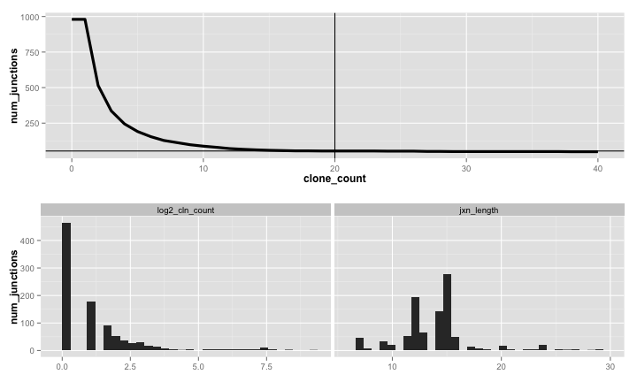
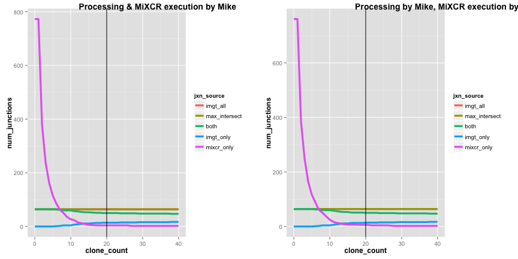

<!-- Limit image width and height -->
<style type="text/css">
img {     
  max-height: 500px;     
  max-width: 800px; 
}
</style>
 
<!-- Center image on slide -->
<script type="text/javascript" src="http://ajax.aspnetcdn.com/ajax/jQuery/jquery-1.7.min.js"></script>
<script type="text/javascript">
$(function() {     
  $("p:has(img)").addClass('centered'); 
});
</script>

<!-- Fix markdown emphasis -->
<style>
strong {
  font-weight: bold;
}
em {
  font-style: italic
}
</style>


--- 

## What the heck is this?

<br>
<br>

### `slidify`: presentations made in `R` using Rmarkdown!

> + share code in the same place as text
> + evaluate `R` commands & include outputs in slides
> + include images & other customizations as needed
> + host as HTML on **GitHub**

--- 

## From single cells to clonotypes
#### TCR-sequencing at BRI
<br>

 

---  

## TCR-seq: quantification & clonotype identification 
#### C1 RNA-seq Galaxy workflow developed by Mike Mason et al.
<br>


---  

## MiXCR for clonotype identification & quantification
#### Avoiding the IMGT bottleneck
<br>

> * Very fast, accurate alignment of reads to CDR3 (and other T-, B-cell 
features)  
> * Runs locally, without need for **Trinity** transcriptome assembly
> * Found, implemented, & tested by Mike
> * Produced very similar results to **IMGT V-QUEST** in initial testing (later,
we encountered some discrepancies related to input data)

---  

## Plugging in MiXCR
#### Potential modifications to improve pipeline performance & reliability
<br>


---  

## Investigating discrepancies with MiXCR
#### Variation in MiXCR output & overlap with IMGT
<br>

> * Looking at MiXCR results from different projects, Peter observed dropoff
in number of functional junctions identified
> * By extension, more recent projects also showed worse overlap with IMGT
> * Overlap in these cases appears highly dependent on cutoff used for
`clone count` metric
> * For some of the problematic projects, MiXCR was run by me instead of Mike
> * Projects were also processed in **Galaxy** at different times

---  

## Taking a closer look at P85
#### Exploring MiXCR results with MAIT cells
<br>


---

## Working with clonotype data in `R`
#### New code to save time/effort for testing & analysis
<br>


---  


## Working with clonotype data in `R`
#### Combining MiXCR outputs


```r
source("R/prep_junctions.R")
```


```r
mixcr_folder <- "data/P85/P85_MAIT/mixcrOutput_MM"
project <- "P85"
out_folder <- mixcr_folder

# combine MiXCR junctions into a single file
mixcr_file <- combine_mixcr_outputs(mixcr_folder, out_folder, project)
```

---

## Working with clonotype data in `R`
#### Reading & formatting MiXCR outputs


```r
mixcr <- format_mixcr_jxns(mixcr_file) %>% # read, format junctions
    filter_mixcr_jxns() %>% # remove non-functional, aa length < 7
    list(jxns = .) # store in list object
```

`mixcr$jxns`

|lib_id  | cln_count|v_gene  | v_gene_score|j_gene  | j_gene_score|junction         |
|:-------|---------:|:-------|------------:|:-------|------------:|:----------------|
|lib3635 |         2|TRAV8-7 |           67|TRAJ19  |           55|CAGADRLQTGMRGAF  |
|lib3636 |         8|TRAV24  |           80|TRAJ7   |           41|CAFIFRIWSKELYSNF |
|lib3636 |         3|TRAV8-7 |           44|TRAJ19  |           36|CAGADRLQTGMRGAF  |
|lib3636 |         1|TRBV19  |           74|TRAJ51  |           50|CGQLYLKPLSDFPV   |
|lib3637 |       190|TRBV6-1 |          164|TRBJ2-7 |          133|CASSEGDSGGYEQYF  |

--- 

## Working with clonotype data in `R`
#### Visually inspecting MiXCR junction data
<br>

`plot_mixcr_jxn_dist()` & `plot_mixcr_summary()`
 

--- 

## Working with clonotype data in `R`
#### Reading & formatting IMGT outputs


```r
imgt_file <- "data/P85/P85_MAIT/complied_P85_Prilic_1_and_2_productive_trimmed_unique.txt"

imgt <- format_imgt_jxns(imgt_file) %>% # read and filter IMGT junctions
    filter_imgt_jxns() %>% # remove non-functional, aa length < 7
    filter(!str_detect(lib_id, "lib2.*")) %>% # remove older samples
    list(jxns = .) # store in list object
```

`imgt$jxns`

|lib_id  |v_gene   |j_gene  |junction        |
|:-------|:--------|:-------|:---------------|
|lib3637 |TRBV6-1  |TRBJ2-7 |CASSEGDSGGYEQYF |
|lib3638 |TRBV20-1 |TRBJ2-5 |CSAPTGDSETQYF   |
|lib3639 |TRAV4    |TRAJ10  |CLVGVFTGGGNKLTF |
|lib3642 |TRAV1-2  |TRAJ33  |CAVMDSNYQLIW    |
|lib3642 |TRBV6-4  |TRBJ2-3 |CASSPAGGTDTQYF  |

--- 

## Working with clonotype data in `R`
#### Inspecting IMGT & MiXCR junction overlap
<br>


--- 

## Investigating discrepancies with MiXCR
#### Checking for user variability with P85
<br>



--- 

## Investigating discrepancies with MiXCR
#### Checking the effect of RNA-seq parameters
<br>

+ **Read trimming:** adapter trimming, 3' end trimming, quality trimming  
+ **Duplicate removal:** yes or no
+ **Read length:** 100bp (long) vs. 58bp (short)

**Testing:** used RNA-seq data from flowcell C4WYJACXX (8/12/2014): 100bp reads

+ selected 20 samples  
+ manually simulated shorter reads for same set of samples  
+ varied other parameters (updated Mike's code for running MiXCR to include
options for read trimming, duplicate filtering, etc. - independent of Galaxy)
+ ran both MiXCR & IMGT (bonus function: `compile_imgt_output()`)  


--- 

## Investigating discrepancies with MiXCR
#### Checking the effect of RNA-seq parameters
<br>


---

## Investigating discrepancies with MiXCR
#### Examining inconsistencies in final TCR clonotypes
<br>

+ For libraries from project P91 (T1D), MiXCR assigned different \alpha-\beta 
(sometimes junctions, sometimes genes) combinations than IMGT V-QUEST  
+ Clonotypes from MiXCR highly dependent on clone count


---

## Taking a closer look at P91
#### Tracking down the source of clonotype mismatches
<br>

+ Compared MiXCR and IMGT outputs for project P91-11
+ Used a 'moderate' clone count cutoff of **10**
+ When results disagreed, looked both at final clonotype outputs from MiXCR
as well as intermediate results (i.e., alignments)


More new code! (for dealing with more TCR-related tasks)

```r
source("R/inspect_tcrs.R")
```

---

## Working with clonotype data in `R`
#### Constructing & inspecting TCRs from IMGT outputs
<br>


```r
# combine TRAV and TRBV junctions for each library to construct TCRs
p91_imgt[["tcrs"]] <- p91_imgt$jxns %>% 
    construct_tcrs()
```

`p91_imgt$tcrs`

|lib_id  |trav_gene |trav_jxn         |trbv_gene |trbv_jxn           |
|:-------|:---------|:----------------|:---------|:------------------|
|lib8472 |TRAV25    |CAGQTGANNLFF     |TRBV4-3   |CASSQEVGTVPNQPQHF  |
|lib8474 |TRAV12-3  |CAMSRILTGGGNKLTF |TRBV7-2   |CASSFPSSPLHF       |
|lib8451 |TRAV25    |CAGQTGANNLFF     |TRBV4-3   |CASSQEVGTVPNQPQHF  |
|lib8453 |TRAV16    |CALLKGSGAGSYQLTF |TRBV20-1  |CSAPRGASGGSSYNEQFF |
|lib8493 |TRAV8-4   |CAVYGGATNKLIF    |TRBV5-1   |CASSLDPGPNEQFF     |

---

## Working with clonotype data in `R`
#### Constructing TCRs with MiXCR: selecting top junctions 
<br>


```r
# for each library, sort junctions first by clone count then by alignment score 
# to select top junction sequence and top corresponding V gene hit for both the
# alpha and beta chain
p91_mixcr[["tcrs"]] <- p91_mixcr$jxns %>% 
    select_top_jxns() %>% # return only top TRAV and TRBV for each library
    construct_tcrs()
```

`p91_mixcr$tcrs`

|lib_id  |trav_gene |trav_jxn          |trbv_gene |trbv_jxn          |
|:-------|:---------|:-----------------|:---------|:-----------------|
|lib8445 |TRAV26-2  |CILRDTISNFGNEKLTF |TRBV11-1  |CASSFGSSYYGYTF    |
|lib8449 |TRAV26-2  |CILRDTISNFGNEKLTF |TRBV11-1  |CASSFGSSYYGYTF    |
|lib8451 |TRAV25    |CAGQTGANNLFF      |TRBV4-3   |CASSQEVGTVPNQPQHF |
|lib8462 |TRAV8-7   |CAGADRLQTGMRGAF   |TRBV9     |CASSTRQNQPQHF     |

---

## Working with clonotype data in `R`
#### Visualizing TCRs with Sankey diagrams
<br>

+ Circos plots look cool, but aren't as informative for troubleshooting
+ I also don't have a good way to generate them on the fly...
+ Wanted a way to quickly inspect the connections between libraries, V genes,
and junctions: [Sankey diagrams](http://bost.ocks.org/mike/sankey/) (fun 
with **D3**!)


```r
# imgt_mixcr: list object with combined TCRs from IMGT and MiXCR

# construct and display a sankey network linking libs to genes to junctions
imgt_mixcr[["plot"]] <- 
    build_sankey_network(imgt_mixcr$tcrs, 
                         chain = "both") %>% 
    build_sankey_plot(sankey_height = 450)
```

---

## Working with clonotype data in `R`
#### Viewing all TCR relationships for P91 libraries
<br>


<div id = 'chart3e702148274e' class = 'rChart d3_sankey'></div>
<!--Attribution:
Mike Bostock https://github.com/d3/d3-plugins/tree/master/sankey
Mike Bostock http://bost.ocks.org/mike/sankey/
-->

<script>
(function(){
var params = {
 "dom": "chart3e702148274e",
"width":    800,
"height":    450,
"data": {
 "source": [ "lib8472", "lib8474", "lib8451", "lib8453", "lib8493", "lib8444", "lib8445", "lib8482", "lib8485", "lib8488", "lib8464", "lib8467", "lib8449", "lib8445", "lib8449", "lib8451", "lib8462", "lib8464", "lib8467", "lib8474", "lib8480", "lib8482", "lib8488", "lib8493", "lib8472", "lib8474", "lib8451", "lib8453", "lib8493", "lib8444", "lib8445", "lib8482", "lib8485", "lib8488", "lib8464", "lib8467", "lib8449", "lib8445", "lib8449", "lib8451", "lib8462", "lib8464", "lib8467", "lib8474", "lib8480", "lib8482", "lib8488", "lib8493", "TRAV25", "TRAV12-3", "TRAV25", "TRAV16", "TRAV8-4", "TRAV26-2", "TRAV26-2", "TRAV25", "TRAV26-1", "TRAV10", "TRAV25", "TRAV26-2", "TRAV26-2", "TRAV26-2", "TRAV26-2", "TRAV25", "TRAV8-7", "TRAV25", "TRAV26-2", "TRAV12-3", "TRAV12-3", "TRAV25", "TRAV10", "TRAV8-4", "TRBV4-3", "TRBV7-2", "TRBV4-3", "TRBV20-1", "TRBV5-1", "TRBV7-9", "TRBV7-9", "TRBV4-3", "TRBV18", "TRBV25-1", "TRBV4-3", "TRBV7-9", "TRBV7-9", "TRBV11-1", "TRBV11-1", "TRBV4-3", "TRBV9", "TRBV12-1", "TRBV11-1", "TRBV11-3", "TRBV6-3", "TRBV4-3", "TRBV25-1", "TRBV5-1" ],
"target": [ "TRAV25", "TRAV12-3", "TRAV25", "TRAV16", "TRAV8-4", "TRAV26-2", "TRAV26-2", "TRAV25", "TRAV26-1", "TRAV10", "TRAV25", "TRAV26-2", "TRAV26-2", "TRAV26-2", "TRAV26-2", "TRAV25", "TRAV8-7", "TRAV25", "TRAV26-2", "TRAV12-3", "TRAV12-3", "TRAV25", "TRAV10", "TRAV8-4", "TRBV4-3", "TRBV7-2", "TRBV4-3", "TRBV20-1", "TRBV5-1", "TRBV7-9", "TRBV7-9", "TRBV4-3", "TRBV18", "TRBV25-1", "TRBV4-3", "TRBV7-9", "TRBV7-9", "TRBV11-1", "TRBV11-1", "TRBV4-3", "TRBV9", "TRBV12-1", "TRBV11-1", "TRBV11-3", "TRBV6-3", "TRBV4-3", "TRBV25-1", "TRBV5-1", "CAGQTGANNLFF", "CAMSRILTGGGNKLTF", "CAGQTGANNLFF", "CALLKGSGAGSYQLTF", "CAVYGGATNKLIF", "CILRDTISNFGNEKLTF", "CILRDTISNFGNEKLTF", "CAGQTGANNLFF", "CIVRVGESGGGADGLTF", "CVVSDRGSTLGRLYF", "CAGQTGANNLFF", "CILRDTISNFGNEKLTF", "CILRDTISNFGNEKLTF", "CILRDTISNFGNEKLTF", "CILRDTISNFGNEKLTF", "CAGQTGANNLFF", "CAGADRLQTGMRGAF", "CAGQTGANNLFF", "CILRDTISNFGNEKLTF", "CAMSRILTGGGNKLTF", "CAMNNENARLLTF", "CAGQTGANNLFF", "CVVSDRGSTLGRLYF", "CAVYGGATNKLIF", "CASSQEVGTVPNQPQHF", "CASSFPSSPLHF", "CASSQEVGTVPNQPQHF", "CSAPRGASGGSSYNEQFF", "CASSLDPGPNEQFF", "CASSFGSSYYGYTF", "CASSFGSSYYGYTF", "CASSQEVGTVPNQPQHF", "CASSRIQGAQGYTF", "CASSEPLAGVNNEQFF", "CASSQEVGTVPNQPQHF", "CASSFGSSYYGYTF", "CASSFGSSYYGYTF", "CASSFGSSYYGYTF", "CASSFGSSYYGYTF", "CASSQEVGTVPNQPQHF", "CASSTRQNQPQHF", "CEKHNFVF", "CASSFGSSYYGYTF", "CASSFPSSPLHF", "CASRSTGTGGAYGYTF", "CASSQEVGTVPNQPQHF", "CASSEPLAGVNNEQFF", "CASSLDPGPNEQFF" ],
"value": [ 8472.1, 8474.1, 8451.1, 8453.1, 8493.1, 8444.1, 8445.1, 8482.1, 8485.1, 8488.1, 8464.1, 8467.1, 8449.1, 8445.2, 8449.2, 8451.2, 8462.2, 8464.2, 8467.2, 8474.2, 8480.2, 8482.2, 8488.2, 8493.2, 8472.1, 8474.1, 8451.1, 8453.1, 8493.1, 8444.1, 8445.1, 8482.1, 8485.1, 8488.1, 8464.1, 8467.1, 8449.1, 8445.2, 8449.2, 8451.2, 8462.2, 8464.2, 8467.2, 8474.2, 8480.2, 8482.2, 8488.2, 8493.2, 8472.1, 8474.1, 8451.1, 8453.1, 8493.1, 8444.1, 8445.1, 8482.1, 8485.1, 8488.1, 8464.1, 8467.1, 8449.1, 8445.2, 8449.2, 8451.2, 8462.2, 8464.2, 8467.2, 8474.2, 8480.2, 8482.2, 8488.2, 8493.2, 8472.1, 8474.1, 8451.1, 8453.1, 8493.1, 8444.1, 8445.1, 8482.1, 8485.1, 8488.1, 8464.1, 8467.1, 8449.1, 8445.2, 8449.2, 8451.2, 8462.2, 8464.2, 8467.2, 8474.2, 8480.2, 8482.2, 8488.2, 8493.2 ] 
},
"nodeWidth":     15,
"nodePadding":     10,
"layout":     32,
"id": "chart3e702148274e" 
};

params.units ? units = " " + params.units : units = "";

//hard code these now but eventually make available
var formatNumber = d3.format("0.1f"),    // zero decimal places
    format = function(d) { return formatNumber(d) + units; },
    color = d3.scale.category20();

if(params.labelFormat){
  formatNumber = d3.format(".2%");
}

var svg = d3.select('#' + params.id).append("svg")
    .attr("width", params.width)
    .attr("height", params.height);

var sankey = d3.sankey()
    .nodeWidth(params.nodeWidth)
    .nodePadding(params.nodePadding)
    .layout(params.layout)
    .size([params.width,params.height]);

var path = sankey.link();

var data = params.data,
    links = [],
    nodes = [];

//get all source and target into nodes
//will reduce to unique in the next step
//also get links in object form
data.source.forEach(function (d, i) {
    nodes.push({ "name": data.source[i] });
    nodes.push({ "name": data.target[i] });
    links.push({ "source": data.source[i], "target": data.target[i], "value": +data.value[i] });
});

//now get nodes based on links data
//thanks Mike Bostock https://groups.google.com/d/msg/d3-js/pl297cFtIQk/Eso4q_eBu1IJ
//this handy little function returns only the distinct / unique nodes
nodes = d3.keys(d3.nest()
                .key(function (d) { return d.name; })
                .map(nodes));

//it appears d3 with force layout wants a numeric source and target
//so loop through each link replacing the text with its index from node
links.forEach(function (d, i) {
    links[i].source = nodes.indexOf(links[i].source);
    links[i].target = nodes.indexOf(links[i].target);
});

//now loop through each nodes to make nodes an array of objects rather than an array of strings
nodes.forEach(function (d, i) {
    nodes[i] = { "name": d };
});

sankey
  .nodes(nodes)
  .links(links)
  .layout(params.layout);

var link = svg.append("g").selectAll(".link")
  .data(links)
.enter().append("path")
  .attr("class", "link")
  .attr("d", path)
  .style("stroke-width", function (d) { return Math.max(1, d.dy); })
  .style('stroke', function(d){
      if (format(d.value % 1) == 0.2) {
        return('#56B4E9');
      } else {
        return('#E69F00');
      }
    })
    .style('stroke-opacity', 0.5)
    .on('mouseover', function(d){
      d3.select(this)
        .style('stroke-opacity', 0.9)
    })
    .on('mouseout', function(d){
      d3.select(this)
        .style('stroke-opacity', 0.5)
    })
  .sort(function (a, b) {
      return (b.dy - a.dy);
  });

link.append("title")
  .text(function (d) {
      if (format(d.value % 1) == 0.2) {
          return d.source.name + " → " + d.target.name + "\nlib" + parseInt(format(d.value)) + " [MiXCR only]";
      } else {
          return d.source.name + " → " + d.target.name + "\nlib" + parseInt(format(d.value)) + " [Trinity+MiXCR]";
      }
  });

var node = svg.append("g").selectAll(".node")
  .data(nodes)
.enter().append("g")
  .attr("class", "node")
  .attr("transform", function (d) { return "translate(" + d.x + "," + d.y + ")"; })
.call(d3.behavior.drag()
  .origin(function (d) { return d; })
  .on("dragstart", function () { this.parentNode.appendChild(this); })
  .on("drag", dragmove));

node.append("rect")
  .attr("height", function (d) { return d.dy; })
  .attr("width", sankey.nodeWidth())
  .style("fill", "#666666") //function (d) { return d.color = color(d.name.replace(/ .*/, "")); })
  .style("stroke", "#333333") //function (d) { return d3.rgb(d.color).darker(2); })
.append("title")
  .text(function (d) { return d.name + "\n" + format(d.value); });

node.append("text")
  .attr("x", -6)
  .attr("y", function (d) { return d.dy / 2; })
  .attr("dy", ".35em")
  .attr("text-anchor", "end")
  .attr("transform", null)
  .text(function (d) { return d.name; })
.filter(function (d) { return d.x < params.width / 2; })
  .attr("x", 6 + sankey.nodeWidth())
  .attr("text-anchor", "start");

// the function for moving the nodes
  function dragmove(d) {
    d3.select(this).attr("transform",
        "translate(" + (
                   d.x = Math.max(0, Math.min(params.width - d.dx, d3.event.x))
                ) + "," + (
                   d.y = Math.max(0, Math.min(params.height - d.dy, d3.event.y))
                ) + ")");
        sankey.relayout();
        link.attr("d", path);
  }
})();
</script>

--- 

## Working with clonotype data in `R`
#### Viewing only beta chain for P91 libraries
<br>


 

<div id = 'chart3e70227998b2' class = 'rChart d3_sankey'></div>
<!--Attribution:
Mike Bostock https://github.com/d3/d3-plugins/tree/master/sankey
Mike Bostock http://bost.ocks.org/mike/sankey/
-->

<script>
(function(){
var params = {
 "dom": "chart3e70227998b2",
"width":    800,
"height":    450,
"data": {
 "source": [ "lib8472", "lib8474", "lib8451", "lib8453", "lib8493", "lib8444", "lib8445", "lib8482", "lib8485", "lib8488", "lib8464", "lib8467", "lib8449", "lib8445", "lib8449", "lib8451", "lib8462", "lib8464", "lib8467", "lib8474", "lib8480", "lib8482", "lib8488", "lib8493", "TRBV4-3", "TRBV7-2", "TRBV4-3", "TRBV20-1", "TRBV5-1", "TRBV7-9", "TRBV7-9", "TRBV4-3", "TRBV18", "TRBV25-1", "TRBV4-3", "TRBV7-9", "TRBV7-9", "TRBV11-1", "TRBV11-1", "TRBV4-3", "TRBV9", "TRBV12-1", "TRBV11-1", "TRBV11-3", "TRBV6-3", "TRBV4-3", "TRBV25-1", "TRBV5-1" ],
"target": [ "TRBV4-3", "TRBV7-2", "TRBV4-3", "TRBV20-1", "TRBV5-1", "TRBV7-9", "TRBV7-9", "TRBV4-3", "TRBV18", "TRBV25-1", "TRBV4-3", "TRBV7-9", "TRBV7-9", "TRBV11-1", "TRBV11-1", "TRBV4-3", "TRBV9", "TRBV12-1", "TRBV11-1", "TRBV11-3", "TRBV6-3", "TRBV4-3", "TRBV25-1", "TRBV5-1", "CASSQEVGTVPNQPQHF", "CASSFPSSPLHF", "CASSQEVGTVPNQPQHF", "CSAPRGASGGSSYNEQFF", "CASSLDPGPNEQFF", "CASSFGSSYYGYTF", "CASSFGSSYYGYTF", "CASSQEVGTVPNQPQHF", "CASSRIQGAQGYTF", "CASSEPLAGVNNEQFF", "CASSQEVGTVPNQPQHF", "CASSFGSSYYGYTF", "CASSFGSSYYGYTF", "CASSFGSSYYGYTF", "CASSFGSSYYGYTF", "CASSQEVGTVPNQPQHF", "CASSTRQNQPQHF", "CEKHNFVF", "CASSFGSSYYGYTF", "CASSFPSSPLHF", "CASRSTGTGGAYGYTF", "CASSQEVGTVPNQPQHF", "CASSEPLAGVNNEQFF", "CASSLDPGPNEQFF" ],
"value": [ 8472.1, 8474.1, 8451.1, 8453.1, 8493.1, 8444.1, 8445.1, 8482.1, 8485.1, 8488.1, 8464.1, 8467.1, 8449.1, 8445.2, 8449.2, 8451.2, 8462.2, 8464.2, 8467.2, 8474.2, 8480.2, 8482.2, 8488.2, 8493.2, 8472.1, 8474.1, 8451.1, 8453.1, 8493.1, 8444.1, 8445.1, 8482.1, 8485.1, 8488.1, 8464.1, 8467.1, 8449.1, 8445.2, 8449.2, 8451.2, 8462.2, 8464.2, 8467.2, 8474.2, 8480.2, 8482.2, 8488.2, 8493.2 ] 
},
"nodeWidth":     15,
"nodePadding":     10,
"layout":     32,
"id": "chart3e70227998b2" 
};

params.units ? units = " " + params.units : units = "";

//hard code these now but eventually make available
var formatNumber = d3.format("0.1f"),    // zero decimal places
    format = function(d) { return formatNumber(d) + units; },
    color = d3.scale.category20();

if(params.labelFormat){
  formatNumber = d3.format(".2%");
}

var svg = d3.select('#' + params.id).append("svg")
    .attr("width", params.width)
    .attr("height", params.height);

var sankey = d3.sankey()
    .nodeWidth(params.nodeWidth)
    .nodePadding(params.nodePadding)
    .layout(params.layout)
    .size([params.width,params.height]);

var path = sankey.link();

var data = params.data,
    links = [],
    nodes = [];

//get all source and target into nodes
//will reduce to unique in the next step
//also get links in object form
data.source.forEach(function (d, i) {
    nodes.push({ "name": data.source[i] });
    nodes.push({ "name": data.target[i] });
    links.push({ "source": data.source[i], "target": data.target[i], "value": +data.value[i] });
});

//now get nodes based on links data
//thanks Mike Bostock https://groups.google.com/d/msg/d3-js/pl297cFtIQk/Eso4q_eBu1IJ
//this handy little function returns only the distinct / unique nodes
nodes = d3.keys(d3.nest()
                .key(function (d) { return d.name; })
                .map(nodes));

//it appears d3 with force layout wants a numeric source and target
//so loop through each link replacing the text with its index from node
links.forEach(function (d, i) {
    links[i].source = nodes.indexOf(links[i].source);
    links[i].target = nodes.indexOf(links[i].target);
});

//now loop through each nodes to make nodes an array of objects rather than an array of strings
nodes.forEach(function (d, i) {
    nodes[i] = { "name": d };
});

sankey
  .nodes(nodes)
  .links(links)
  .layout(params.layout);

var link = svg.append("g").selectAll(".link")
  .data(links)
.enter().append("path")
  .attr("class", "link")
  .attr("d", path)
  .style("stroke-width", function (d) { return Math.max(1, d.dy); })
  .style('stroke', function(d){
      if (format(d.value % 1) == 0.2) {
        return('#56B4E9');
      } else {
        return('#E69F00');
      }
    })
    .style('stroke-opacity', 0.5)
    .on('mouseover', function(d){
      d3.select(this)
        .style('stroke-opacity', 0.9)
    })
    .on('mouseout', function(d){
      d3.select(this)
        .style('stroke-opacity', 0.5)
    })
  .sort(function (a, b) {
      return (b.dy - a.dy);
  });

link.append("title")
  .text(function (d) {
      if (format(d.value % 1) == 0.2) {
          return d.source.name + " → " + d.target.name + "\nlib" + parseInt(format(d.value)) + " [MiXCR only]";
      } else {
          return d.source.name + " → " + d.target.name + "\nlib" + parseInt(format(d.value)) + " [Trinity+MiXCR]";
      }
  });

var node = svg.append("g").selectAll(".node")
  .data(nodes)
.enter().append("g")
  .attr("class", "node")
  .attr("transform", function (d) { return "translate(" + d.x + "," + d.y + ")"; })
.call(d3.behavior.drag()
  .origin(function (d) { return d; })
  .on("dragstart", function () { this.parentNode.appendChild(this); })
  .on("drag", dragmove));

node.append("rect")
  .attr("height", function (d) { return d.dy; })
  .attr("width", sankey.nodeWidth())
  .style("fill", "#666666") //function (d) { return d.color = color(d.name.replace(/ .*/, "")); })
  .style("stroke", "#333333") //function (d) { return d3.rgb(d.color).darker(2); })
.append("title")
  .text(function (d) { return d.name + "\n" + format(d.value); });

node.append("text")
  .attr("x", -6)
  .attr("y", function (d) { return d.dy / 2; })
  .attr("dy", ".35em")
  .attr("text-anchor", "end")
  .attr("transform", null)
  .text(function (d) { return d.name; })
.filter(function (d) { return d.x < params.width / 2; })
  .attr("x", 6 + sankey.nodeWidth())
  .attr("text-anchor", "start");

// the function for moving the nodes
  function dragmove(d) {
    d3.select(this).attr("transform",
        "translate(" + (
                   d.x = Math.max(0, Math.min(params.width - d.dx, d3.event.x))
                ) + "," + (
                   d.y = Math.max(0, Math.min(params.height - d.dy, d3.event.y))
                ) + ")");
        sankey.relayout();
        link.attr("d", path);
  }
})();
</script>

--- 

## Investigating discrepancies with MiXCR
#### Looking only at different TRBV gene/junction assignments
<br>


<div id = 'chart3e706cf4b1cd' class = 'rChart d3_sankey'></div>
<!--Attribution:
Mike Bostock https://github.com/d3/d3-plugins/tree/master/sankey
Mike Bostock http://bost.ocks.org/mike/sankey/
-->

<script>
(function(){
var params = {
 "dom": "chart3e706cf4b1cd",
"width":    800,
"height":    450,
"data": {
 "source": [ "lib8449", "lib8467", "lib8464", "lib8485", "lib8445", "lib8444", "lib8453", "lib8474", "lib8472", "lib8480", "lib8474", "lib8467", "lib8464", "lib8462", "lib8449", "lib8445", "TRBV7-9", "TRBV7-9", "TRBV4-3", "TRBV18", "TRBV7-9", "TRBV7-9", "TRBV20-1", "TRBV7-2", "TRBV4-3", "TRBV6-3", "TRBV11-3", "TRBV11-1", "TRBV12-1", "TRBV9", "TRBV11-1", "TRBV11-1" ],
"target": [ "TRBV7-9", "TRBV7-9", "TRBV4-3", "TRBV18", "TRBV7-9", "TRBV7-9", "TRBV20-1", "TRBV7-2", "TRBV4-3", "TRBV6-3", "TRBV11-3", "TRBV11-1", "TRBV12-1", "TRBV9", "TRBV11-1", "TRBV11-1", "CASSFGSSYYGYTF", "CASSFGSSYYGYTF", "CASSQEVGTVPNQPQHF", "CASSRIQGAQGYTF", "CASSFGSSYYGYTF", "CASSFGSSYYGYTF", "CSAPRGASGGSSYNEQFF", "CASSFPSSPLHF", "CASSQEVGTVPNQPQHF", "CASRSTGTGGAYGYTF", "CASSFPSSPLHF", "CASSFGSSYYGYTF", "CEKHNFVF", "CASSTRQNQPQHF", "CASSFGSSYYGYTF", "CASSFGSSYYGYTF" ],
"value": [ 8449.1, 8467.1, 8464.1, 8485.1, 8445.1, 8444.1, 8453.1, 8474.1, 8472.1, 8480.2, 8474.2, 8467.2, 8464.2, 8462.2, 8449.2, 8445.2, 8449.1, 8467.1, 8464.1, 8485.1, 8445.1, 8444.1, 8453.1, 8474.1, 8472.1, 8480.2, 8474.2, 8467.2, 8464.2, 8462.2, 8449.2, 8445.2 ] 
},
"nodeWidth":     15,
"nodePadding":     10,
"layout":     32,
"id": "chart3e706cf4b1cd" 
};

params.units ? units = " " + params.units : units = "";

//hard code these now but eventually make available
var formatNumber = d3.format("0.1f"),    // zero decimal places
    format = function(d) { return formatNumber(d) + units; },
    color = d3.scale.category20();

if(params.labelFormat){
  formatNumber = d3.format(".2%");
}

var svg = d3.select('#' + params.id).append("svg")
    .attr("width", params.width)
    .attr("height", params.height);

var sankey = d3.sankey()
    .nodeWidth(params.nodeWidth)
    .nodePadding(params.nodePadding)
    .layout(params.layout)
    .size([params.width,params.height]);

var path = sankey.link();

var data = params.data,
    links = [],
    nodes = [];

//get all source and target into nodes
//will reduce to unique in the next step
//also get links in object form
data.source.forEach(function (d, i) {
    nodes.push({ "name": data.source[i] });
    nodes.push({ "name": data.target[i] });
    links.push({ "source": data.source[i], "target": data.target[i], "value": +data.value[i] });
});

//now get nodes based on links data
//thanks Mike Bostock https://groups.google.com/d/msg/d3-js/pl297cFtIQk/Eso4q_eBu1IJ
//this handy little function returns only the distinct / unique nodes
nodes = d3.keys(d3.nest()
                .key(function (d) { return d.name; })
                .map(nodes));

//it appears d3 with force layout wants a numeric source and target
//so loop through each link replacing the text with its index from node
links.forEach(function (d, i) {
    links[i].source = nodes.indexOf(links[i].source);
    links[i].target = nodes.indexOf(links[i].target);
});

//now loop through each nodes to make nodes an array of objects rather than an array of strings
nodes.forEach(function (d, i) {
    nodes[i] = { "name": d };
});

sankey
  .nodes(nodes)
  .links(links)
  .layout(params.layout);

var link = svg.append("g").selectAll(".link")
  .data(links)
.enter().append("path")
  .attr("class", "link")
  .attr("d", path)
  .style("stroke-width", function (d) { return Math.max(1, d.dy); })
  .style('stroke', function(d){
      if (format(d.value % 1) == 0.2) {
        return('#56B4E9');
      } else {
        return('#E69F00');
      }
    })
    .style('stroke-opacity', 0.5)
    .on('mouseover', function(d){
      d3.select(this)
        .style('stroke-opacity', 0.9)
    })
    .on('mouseout', function(d){
      d3.select(this)
        .style('stroke-opacity', 0.5)
    })
  .sort(function (a, b) {
      return (b.dy - a.dy);
  });

link.append("title")
  .text(function (d) {
      if (format(d.value % 1) == 0.2) {
          return d.source.name + " → " + d.target.name + "\nlib" + parseInt(format(d.value)) + " [MiXCR only]";
      } else {
          return d.source.name + " → " + d.target.name + "\nlib" + parseInt(format(d.value)) + " [Trinity+MiXCR]";
      }
  });

var node = svg.append("g").selectAll(".node")
  .data(nodes)
.enter().append("g")
  .attr("class", "node")
  .attr("transform", function (d) { return "translate(" + d.x + "," + d.y + ")"; })
.call(d3.behavior.drag()
  .origin(function (d) { return d; })
  .on("dragstart", function () { this.parentNode.appendChild(this); })
  .on("drag", dragmove));

node.append("rect")
  .attr("height", function (d) { return d.dy; })
  .attr("width", sankey.nodeWidth())
  .style("fill", "#666666") //function (d) { return d.color = color(d.name.replace(/ .*/, "")); })
  .style("stroke", "#333333") //function (d) { return d3.rgb(d.color).darker(2); })
.append("title")
  .text(function (d) { return d.name + "\n" + format(d.value); });

node.append("text")
  .attr("x", -6)
  .attr("y", function (d) { return d.dy / 2; })
  .attr("dy", ".35em")
  .attr("text-anchor", "end")
  .attr("transform", null)
  .text(function (d) { return d.name; })
.filter(function (d) { return d.x < params.width / 2; })
  .attr("x", 6 + sankey.nodeWidth())
  .attr("text-anchor", "start");

// the function for moving the nodes
  function dragmove(d) {
    d3.select(this).attr("transform",
        "translate(" + (
                   d.x = Math.max(0, Math.min(params.width - d.dx, d3.event.x))
                ) + "," + (
                   d.y = Math.max(0, Math.min(params.height - d.dy, d3.event.y))
                ) + ")");
        sankey.relayout();
        link.attr("d", path);
  }
})();
</script>

--- 

## Investigating discrepancies with MiXCR
#### TRBV11-1 vs. TRBV7-9: short reads, non-unique alignments
<br>

```
>>> Alignments with V gene:

TRBV11-1*00 (total score = 160.0)
Alignment of Sequence0 (score = 160.0):
    255 GACTCGGCCATGTATCTCTGTGCCAGCAGCTT 286
        ||||||||||||||||||||||||||||||||
      0 GACTCGGCCATGTATCTCTGTGCCAGCAGCTT 31
        BBBBBFFFFFFFFFFFFFFFFFFFFFFFFFFF

TRBV7-9*00 (total score = 160.0)
Alignment of Sequence0 (score = 160.0):
    255 GACTCGGCCATGTATCTCTGTGCCAGCAGCTT 286
        ||||||||||||||||||||||||||||||||
      0 GACTCGGCCATGTATCTCTGTGCCAGCAGCTT 31
        BBBBBFFFFFFFFFFFFFFFFFFFFFFFFFFF
```

---

## Investigating discrepancies with MiXCR
#### New idea: MiXCR with Trinity?
<br>

+ Came up in discussions with Mike, Scott, Peter
+ Input data for IMGT is actually assembled contigs produced by Trinity (not
short reads)
+ With help from Mike, modified MiXCR code to run on Trinity outputs instead of
trimmed FASTQs (wasn't too hard - MiXCR allows FASTA file input)
+ Compared new results


--- 

## Developing a new approach for MiXCR
#### MiXCR with Trinity reproduces IMGT results
<br>


<div id = 'chart3e7075a5256f' class = 'rChart d3_sankey'></div>
<!--Attribution:
Mike Bostock https://github.com/d3/d3-plugins/tree/master/sankey
Mike Bostock http://bost.ocks.org/mike/sankey/
-->

<script>
(function(){
var params = {
 "dom": "chart3e7075a5256f",
"width":    800,
"height":    450,
"data": {
 "source": [ "lib8472", "lib8474", "lib8451", "lib8453", "lib8493", "lib8444", "lib8445", "lib8482", "lib8485", "lib8488", "lib8464", "lib8467", "lib8449", "lib8444", "lib8445", "lib8449", "lib8451", "lib8453", "lib8464", "lib8467", "lib8472", "lib8474", "lib8482", "lib8485", "lib8488", "lib8493", "TRBV4-3", "TRBV7-2", "TRBV4-3", "TRBV20-1", "TRBV5-1", "TRBV7-9", "TRBV7-9", "TRBV4-3", "TRBV18", "TRBV25-1", "TRBV4-3", "TRBV7-9", "TRBV7-9", "TRBV7-9", "TRBV7-9", "TRBV7-9", "TRBV4-3", "TRBV20-1", "TRBV4-3", "TRBV7-9", "TRBV4-3", "TRBV7-2", "TRBV4-3", "TRBV18", "TRBV25-1", "TRBV5-1" ],
"target": [ "TRBV4-3", "TRBV7-2", "TRBV4-3", "TRBV20-1", "TRBV5-1", "TRBV7-9", "TRBV7-9", "TRBV4-3", "TRBV18", "TRBV25-1", "TRBV4-3", "TRBV7-9", "TRBV7-9", "TRBV7-9", "TRBV7-9", "TRBV7-9", "TRBV4-3", "TRBV20-1", "TRBV4-3", "TRBV7-9", "TRBV4-3", "TRBV7-2", "TRBV4-3", "TRBV18", "TRBV25-1", "TRBV5-1", "CASSQEVGTVPNQPQHF", "CASSFPSSPLHF", "CASSQEVGTVPNQPQHF", "CSAPRGASGGSSYNEQFF", "CASSLDPGPNEQFF", "CASSFGSSYYGYTF", "CASSFGSSYYGYTF", "CASSQEVGTVPNQPQHF", "CASSRIQGAQGYTF", "CASSEPLAGVNNEQFF", "CASSQEVGTVPNQPQHF", "CASSFGSSYYGYTF", "CASSFGSSYYGYTF", "CASSFGSSYYGYTF", "CASSFGSSYYGYTF", "CASSFGSSYYGYTF", "CASSQEVGTVPNQPQHF", "CSAPRGASGGSSYNEQFF", "CASSQEVGTVPNQPQHF", "CASSFGSSYYGYTF", "CASSQEVGTVPNQPQHF", "CASSFPSSPLHF", "CASSQEVGTVPNQPQHF", "CASSRIQGAQGYTF", "CASSEPLAGVNNEQFF", "CASSLDPGPNEQFF" ],
"value": [ 8472.1, 8474.1, 8451.1, 8453.1, 8493.1, 8444.1, 8445.1, 8482.1, 8485.1, 8488.1, 8464.1, 8467.1, 8449.1, 8444.2, 8445.2, 8449.2, 8451.2, 8453.2, 8464.2, 8467.2, 8472.2, 8474.2, 8482.2, 8485.2, 8488.2, 8493.2, 8472.1, 8474.1, 8451.1, 8453.1, 8493.1, 8444.1, 8445.1, 8482.1, 8485.1, 8488.1, 8464.1, 8467.1, 8449.1, 8444.2, 8445.2, 8449.2, 8451.2, 8453.2, 8464.2, 8467.2, 8472.2, 8474.2, 8482.2, 8485.2, 8488.2, 8493.2 ] 
},
"nodeWidth":     15,
"nodePadding":     10,
"layout":     32,
"id": "chart3e7075a5256f" 
};

params.units ? units = " " + params.units : units = "";

//hard code these now but eventually make available
var formatNumber = d3.format("0.1f"),    // zero decimal places
    format = function(d) { return formatNumber(d) + units; },
    color = d3.scale.category20();

if(params.labelFormat){
  formatNumber = d3.format(".2%");
}

var svg = d3.select('#' + params.id).append("svg")
    .attr("width", params.width)
    .attr("height", params.height);

var sankey = d3.sankey()
    .nodeWidth(params.nodeWidth)
    .nodePadding(params.nodePadding)
    .layout(params.layout)
    .size([params.width,params.height]);

var path = sankey.link();

var data = params.data,
    links = [],
    nodes = [];

//get all source and target into nodes
//will reduce to unique in the next step
//also get links in object form
data.source.forEach(function (d, i) {
    nodes.push({ "name": data.source[i] });
    nodes.push({ "name": data.target[i] });
    links.push({ "source": data.source[i], "target": data.target[i], "value": +data.value[i] });
});

//now get nodes based on links data
//thanks Mike Bostock https://groups.google.com/d/msg/d3-js/pl297cFtIQk/Eso4q_eBu1IJ
//this handy little function returns only the distinct / unique nodes
nodes = d3.keys(d3.nest()
                .key(function (d) { return d.name; })
                .map(nodes));

//it appears d3 with force layout wants a numeric source and target
//so loop through each link replacing the text with its index from node
links.forEach(function (d, i) {
    links[i].source = nodes.indexOf(links[i].source);
    links[i].target = nodes.indexOf(links[i].target);
});

//now loop through each nodes to make nodes an array of objects rather than an array of strings
nodes.forEach(function (d, i) {
    nodes[i] = { "name": d };
});

sankey
  .nodes(nodes)
  .links(links)
  .layout(params.layout);

var link = svg.append("g").selectAll(".link")
  .data(links)
.enter().append("path")
  .attr("class", "link")
  .attr("d", path)
  .style("stroke-width", function (d) { return Math.max(1, d.dy); })
  .style('stroke', function(d){
      if (format(d.value % 1) == 0.2) {
        return('#56B4E9');
      } else {
        return('#E69F00');
      }
    })
    .style('stroke-opacity', 0.5)
    .on('mouseover', function(d){
      d3.select(this)
        .style('stroke-opacity', 0.9)
    })
    .on('mouseout', function(d){
      d3.select(this)
        .style('stroke-opacity', 0.5)
    })
  .sort(function (a, b) {
      return (b.dy - a.dy);
  });

link.append("title")
  .text(function (d) {
      if (format(d.value % 1) == 0.2) {
          return d.source.name + " → " + d.target.name + "\nlib" + parseInt(format(d.value)) + " [MiXCR only]";
      } else {
          return d.source.name + " → " + d.target.name + "\nlib" + parseInt(format(d.value)) + " [Trinity+MiXCR]";
      }
  });

var node = svg.append("g").selectAll(".node")
  .data(nodes)
.enter().append("g")
  .attr("class", "node")
  .attr("transform", function (d) { return "translate(" + d.x + "," + d.y + ")"; })
.call(d3.behavior.drag()
  .origin(function (d) { return d; })
  .on("dragstart", function () { this.parentNode.appendChild(this); })
  .on("drag", dragmove));

node.append("rect")
  .attr("height", function (d) { return d.dy; })
  .attr("width", sankey.nodeWidth())
  .style("fill", "#666666") //function (d) { return d.color = color(d.name.replace(/ .*/, "")); })
  .style("stroke", "#333333") //function (d) { return d3.rgb(d.color).darker(2); })
.append("title")
  .text(function (d) { return d.name + "\n" + format(d.value); });

node.append("text")
  .attr("x", -6)
  .attr("y", function (d) { return d.dy / 2; })
  .attr("dy", ".35em")
  .attr("text-anchor", "end")
  .attr("transform", null)
  .text(function (d) { return d.name; })
.filter(function (d) { return d.x < params.width / 2; })
  .attr("x", 6 + sankey.nodeWidth())
  .attr("text-anchor", "start");

// the function for moving the nodes
  function dragmove(d) {
    d3.select(this).attr("transform",
        "translate(" + (
                   d.x = Math.max(0, Math.min(params.width - d.dx, d3.event.x))
                ) + "," + (
                   d.y = Math.max(0, Math.min(params.height - d.dy, d3.event.y))
                ) + ")");
        sankey.relayout();
        link.attr("d", path);
  }
})();
</script>

--- 

## Developing a new approach for MiXCR
#### Not just beta chain - results match for both TRAV and TRBV
<br>


<div id = 'chart3e706960fc23' class = 'rChart d3_sankey'></div>
<!--Attribution:
Mike Bostock https://github.com/d3/d3-plugins/tree/master/sankey
Mike Bostock http://bost.ocks.org/mike/sankey/
-->

<script>
(function(){
var params = {
 "dom": "chart3e706960fc23",
"width":    800,
"height":    450,
"data": {
 "source": [ "lib8472", "lib8474", "lib8451", "lib8453", "lib8493", "lib8444", "lib8445", "lib8482", "lib8485", "lib8488", "lib8464", "lib8467", "lib8449", "lib8444", "lib8445", "lib8449", "lib8451", "lib8453", "lib8464", "lib8467", "lib8472", "lib8474", "lib8482", "lib8485", "lib8488", "lib8493", "lib8472", "lib8474", "lib8451", "lib8453", "lib8493", "lib8444", "lib8445", "lib8482", "lib8485", "lib8488", "lib8464", "lib8467", "lib8449", "lib8444", "lib8445", "lib8449", "lib8451", "lib8453", "lib8464", "lib8467", "lib8472", "lib8474", "lib8482", "lib8485", "lib8488", "lib8493", "TRAV25", "TRAV12-3", "TRAV25", "TRAV16", "TRAV8-4", "TRAV26-2", "TRAV26-2", "TRAV25", "TRAV26-1", "TRAV10", "TRAV25", "TRAV26-2", "TRAV26-2", "TRAV26-2", "TRAV26-2", "TRAV26-2", "TRAV25", "TRAV16", "TRAV25", "TRAV26-2", "TRAV25", "TRAV12-3", "TRAV25", "TRAV26-1", "TRAV10", "TRAV8-4", "TRBV4-3", "TRBV7-2", "TRBV4-3", "TRBV20-1", "TRBV5-1", "TRBV7-9", "TRBV7-9", "TRBV4-3", "TRBV18", "TRBV25-1", "TRBV4-3", "TRBV7-9", "TRBV7-9", "TRBV7-9", "TRBV7-9", "TRBV7-9", "TRBV4-3", "TRBV20-1", "TRBV4-3", "TRBV7-9", "TRBV4-3", "TRBV7-2", "TRBV4-3", "TRBV18", "TRBV25-1", "TRBV5-1" ],
"target": [ "TRAV25", "TRAV12-3", "TRAV25", "TRAV16", "TRAV8-4", "TRAV26-2", "TRAV26-2", "TRAV25", "TRAV26-1", "TRAV10", "TRAV25", "TRAV26-2", "TRAV26-2", "TRAV26-2", "TRAV26-2", "TRAV26-2", "TRAV25", "TRAV16", "TRAV25", "TRAV26-2", "TRAV25", "TRAV12-3", "TRAV25", "TRAV26-1", "TRAV10", "TRAV8-4", "TRBV4-3", "TRBV7-2", "TRBV4-3", "TRBV20-1", "TRBV5-1", "TRBV7-9", "TRBV7-9", "TRBV4-3", "TRBV18", "TRBV25-1", "TRBV4-3", "TRBV7-9", "TRBV7-9", "TRBV7-9", "TRBV7-9", "TRBV7-9", "TRBV4-3", "TRBV20-1", "TRBV4-3", "TRBV7-9", "TRBV4-3", "TRBV7-2", "TRBV4-3", "TRBV18", "TRBV25-1", "TRBV5-1", "CAGQTGANNLFF", "CAMSRILTGGGNKLTF", "CAGQTGANNLFF", "CALLKGSGAGSYQLTF", "CAVYGGATNKLIF", "CILRDTISNFGNEKLTF", "CILRDTISNFGNEKLTF", "CAGQTGANNLFF", "CIVRVGESGGGADGLTF", "CVVSDRGSTLGRLYF", "CAGQTGANNLFF", "CILRDTISNFGNEKLTF", "CILRDTISNFGNEKLTF", "CILRDTISNFGNEKLTF", "CILRDTISNFGNEKLTF", "CILRDTISNFGNEKLTF", "CAGQTGANNLFF", "CALLKGSGAGSYQLTF", "CAGQTGANNLFF", "CILRDTISNFGNEKLTF", "CAGQTGANNLFF", "CAMSRILTGGGNKLTF", "CAGQTGANNLFF", "CIVRVGESGGGADGLTF", "CVVSDRGSTLGRLYF", "CAVYGGATNKLIF", "CASSQEVGTVPNQPQHF", "CASSFPSSPLHF", "CASSQEVGTVPNQPQHF", "CSAPRGASGGSSYNEQFF", "CASSLDPGPNEQFF", "CASSFGSSYYGYTF", "CASSFGSSYYGYTF", "CASSQEVGTVPNQPQHF", "CASSRIQGAQGYTF", "CASSEPLAGVNNEQFF", "CASSQEVGTVPNQPQHF", "CASSFGSSYYGYTF", "CASSFGSSYYGYTF", "CASSFGSSYYGYTF", "CASSFGSSYYGYTF", "CASSFGSSYYGYTF", "CASSQEVGTVPNQPQHF", "CSAPRGASGGSSYNEQFF", "CASSQEVGTVPNQPQHF", "CASSFGSSYYGYTF", "CASSQEVGTVPNQPQHF", "CASSFPSSPLHF", "CASSQEVGTVPNQPQHF", "CASSRIQGAQGYTF", "CASSEPLAGVNNEQFF", "CASSLDPGPNEQFF" ],
"value": [ 8472.1, 8474.1, 8451.1, 8453.1, 8493.1, 8444.1, 8445.1, 8482.1, 8485.1, 8488.1, 8464.1, 8467.1, 8449.1, 8444.2, 8445.2, 8449.2, 8451.2, 8453.2, 8464.2, 8467.2, 8472.2, 8474.2, 8482.2, 8485.2, 8488.2, 8493.2, 8472.1, 8474.1, 8451.1, 8453.1, 8493.1, 8444.1, 8445.1, 8482.1, 8485.1, 8488.1, 8464.1, 8467.1, 8449.1, 8444.2, 8445.2, 8449.2, 8451.2, 8453.2, 8464.2, 8467.2, 8472.2, 8474.2, 8482.2, 8485.2, 8488.2, 8493.2, 8472.1, 8474.1, 8451.1, 8453.1, 8493.1, 8444.1, 8445.1, 8482.1, 8485.1, 8488.1, 8464.1, 8467.1, 8449.1, 8444.2, 8445.2, 8449.2, 8451.2, 8453.2, 8464.2, 8467.2, 8472.2, 8474.2, 8482.2, 8485.2, 8488.2, 8493.2, 8472.1, 8474.1, 8451.1, 8453.1, 8493.1, 8444.1, 8445.1, 8482.1, 8485.1, 8488.1, 8464.1, 8467.1, 8449.1, 8444.2, 8445.2, 8449.2, 8451.2, 8453.2, 8464.2, 8467.2, 8472.2, 8474.2, 8482.2, 8485.2, 8488.2, 8493.2 ] 
},
"nodeWidth":     15,
"nodePadding":     10,
"layout":     32,
"id": "chart3e706960fc23" 
};

params.units ? units = " " + params.units : units = "";

//hard code these now but eventually make available
var formatNumber = d3.format("0.1f"),    // zero decimal places
    format = function(d) { return formatNumber(d) + units; },
    color = d3.scale.category20();

if(params.labelFormat){
  formatNumber = d3.format(".2%");
}

var svg = d3.select('#' + params.id).append("svg")
    .attr("width", params.width)
    .attr("height", params.height);

var sankey = d3.sankey()
    .nodeWidth(params.nodeWidth)
    .nodePadding(params.nodePadding)
    .layout(params.layout)
    .size([params.width,params.height]);

var path = sankey.link();

var data = params.data,
    links = [],
    nodes = [];

//get all source and target into nodes
//will reduce to unique in the next step
//also get links in object form
data.source.forEach(function (d, i) {
    nodes.push({ "name": data.source[i] });
    nodes.push({ "name": data.target[i] });
    links.push({ "source": data.source[i], "target": data.target[i], "value": +data.value[i] });
});

//now get nodes based on links data
//thanks Mike Bostock https://groups.google.com/d/msg/d3-js/pl297cFtIQk/Eso4q_eBu1IJ
//this handy little function returns only the distinct / unique nodes
nodes = d3.keys(d3.nest()
                .key(function (d) { return d.name; })
                .map(nodes));

//it appears d3 with force layout wants a numeric source and target
//so loop through each link replacing the text with its index from node
links.forEach(function (d, i) {
    links[i].source = nodes.indexOf(links[i].source);
    links[i].target = nodes.indexOf(links[i].target);
});

//now loop through each nodes to make nodes an array of objects rather than an array of strings
nodes.forEach(function (d, i) {
    nodes[i] = { "name": d };
});

sankey
  .nodes(nodes)
  .links(links)
  .layout(params.layout);

var link = svg.append("g").selectAll(".link")
  .data(links)
.enter().append("path")
  .attr("class", "link")
  .attr("d", path)
  .style("stroke-width", function (d) { return Math.max(1, d.dy); })
  .style('stroke', function(d){
      if (format(d.value % 1) == 0.2) {
        return('#56B4E9');
      } else {
        return('#E69F00');
      }
    })
    .style('stroke-opacity', 0.5)
    .on('mouseover', function(d){
      d3.select(this)
        .style('stroke-opacity', 0.9)
    })
    .on('mouseout', function(d){
      d3.select(this)
        .style('stroke-opacity', 0.5)
    })
  .sort(function (a, b) {
      return (b.dy - a.dy);
  });

link.append("title")
  .text(function (d) {
      if (format(d.value % 1) == 0.2) {
          return d.source.name + " → " + d.target.name + "\nlib" + parseInt(format(d.value)) + " [MiXCR only]";
      } else {
          return d.source.name + " → " + d.target.name + "\nlib" + parseInt(format(d.value)) + " [Trinity+MiXCR]";
      }
  });

var node = svg.append("g").selectAll(".node")
  .data(nodes)
.enter().append("g")
  .attr("class", "node")
  .attr("transform", function (d) { return "translate(" + d.x + "," + d.y + ")"; })
.call(d3.behavior.drag()
  .origin(function (d) { return d; })
  .on("dragstart", function () { this.parentNode.appendChild(this); })
  .on("drag", dragmove));

node.append("rect")
  .attr("height", function (d) { return d.dy; })
  .attr("width", sankey.nodeWidth())
  .style("fill", "#666666") //function (d) { return d.color = color(d.name.replace(/ .*/, "")); })
  .style("stroke", "#333333") //function (d) { return d3.rgb(d.color).darker(2); })
.append("title")
  .text(function (d) { return d.name + "\n" + format(d.value); });

node.append("text")
  .attr("x", -6)
  .attr("y", function (d) { return d.dy / 2; })
  .attr("dy", ".35em")
  .attr("text-anchor", "end")
  .attr("transform", null)
  .text(function (d) { return d.name; })
.filter(function (d) { return d.x < params.width / 2; })
  .attr("x", 6 + sankey.nodeWidth())
  .attr("text-anchor", "start");

// the function for moving the nodes
  function dragmove(d) {
    d3.select(this).attr("transform",
        "translate(" + (
                   d.x = Math.max(0, Math.min(params.width - d.dx, d3.event.x))
                ) + "," + (
                   d.y = Math.max(0, Math.min(params.height - d.dy, d3.event.y))
                ) + ")");
        sankey.relayout();
        link.attr("d", path);
  }
})();
</script>

---

## Insights & advice from the MiLaboratory
#### Following up with the developers of MiXCR
<br>

> + Worked with Mike to summarize findings and questions, shared with Dmitry 
Bolotin (first author of MiXCR paper)
> + Re: alignment performance with short reads: selecting only top gene hit 
will return whatever comes first, lexicographically, in the case of non-unique 
alignments (in the case of short reads, such alignment degeneracy is expected)
> + Suggested some additional output options & parameters to return *all* gene
hits for a particular CDR3 junction
> + Agreed that Trinity assembled contigs (especially on homogeneous data)
should produce more accurate results
> + Suggested additional parameters more specific to RNA-seq data
> + Working on related pipelines that would pre-filter reads before assembly

----

## Investigating discrepancies with MiXCR
#### Revisiting read length in MiXCR clonotype identification
<br>

+ Bulk libraries from project P48 (clones)
+ From flowcell C3523ACXX (4/8/2014): 100bp reads
+ Recently reprocessed for Peter, decided to check out MiXCR results with and
without Trinity (no IMGT comparison this time)


---

## Taking a closer look at P48
#### Even for 100bp, MiXCR TCRs differ between reads & Trinity contigs
<br>


<div id = 'chart3e7038cf0126' class = 'rChart d3_sankey'></div>
<!--Attribution:
Mike Bostock https://github.com/d3/d3-plugins/tree/master/sankey
Mike Bostock http://bost.ocks.org/mike/sankey/
-->

<script>
(function(){
var params = {
 "dom": "chart3e7038cf0126",
"width":    800,
"height":    450,
"data": {
 "source": [ "lib2268", "lib2269", "lib2366", "lib2367", "lib2368", "lib2372", "lib2373", "lib2377", "lib2378", "lib2268", "lib2366", "lib2367", "lib2368", "lib2372", "lib2373", "lib2377", "lib2378", "lib2268", "lib2269", "lib2366", "lib2367", "lib2368", "lib2372", "lib2373", "lib2377", "lib2378", "lib2268", "lib2366", "lib2367", "lib2368", "lib2372", "lib2373", "lib2377", "lib2378", "TRAV19", "TRAV19", "TRAV8-3", "TRAV19", "TRAV8-3", "TRAV19", "TRAV19", "TRAV19", "TRAV8-3", "TRAV19", "TRAV19", "TRAV19", "TRAV19", "TRAV19", "TRAV19", "TRAV19", "TRAV19", "TRBV5-1", "TRBV5-1", "TRBV5-1", "TRBV5-1", "TRBV5-1", "TRBV5-1", "TRBV5-1", "TRBV5-1", "TRBV5-1", "TRBV5-1", "TRBV5-1", "TRBV5-1", "TRBV5-1", "TRBV5-1", "TRBV5-1", "TRBV5-1", "TRBV5-1" ],
"target": [ "TRAV19", "TRAV19", "TRAV8-3", "TRAV19", "TRAV8-3", "TRAV19", "TRAV19", "TRAV19", "TRAV8-3", "TRAV19", "TRAV19", "TRAV19", "TRAV19", "TRAV19", "TRAV19", "TRAV19", "TRAV19", "TRBV5-1", "TRBV5-1", "TRBV5-1", "TRBV5-1", "TRBV5-1", "TRBV5-1", "TRBV5-1", "TRBV5-1", "TRBV5-1", "TRBV5-1", "TRBV5-1", "TRBV5-1", "TRBV5-1", "TRBV5-1", "TRBV5-1", "TRBV5-1", "TRBV5-1", "CALSENRGGTASKLTF", "CALSENRGGTASKLTF", "CALQTGANNLFF", "CALSENRGGTASKLTF", "CALQTGANNLFF", "CALSENRGGTASKLTF", "CALSENRGGTASKLTF", "CALSENRGGTASKLTF", "CALQTGANNLFF", "CALSENRGGTASKLTF", "CALSENRGGTASKLTF", "CALSENRGGTASKLTF", "CALSENRGGTASKLTF", "CALSENRGGTASKLTF", "CALSENRGGTASKLTF", "CALSENRGGTASKLTF", "CALSENRGGTASKLTF", "CASSLVGGPSSEAFF", "CASSLVGGPSSEAFF", "CASSLVGGPSSEAFF", "CASSLVGGPSSEAFF", "CASSLVGGPSSEAFF", "CASSLVGGPSSEAFF", "CASSLVGGPSSEAFF", "CASSLVGGPSSEAFF", "CASSLVGGPSSEAFF", "CASSLVGGPSSEAFF", "CASSLVGGPSSEAFF", "CASSLVGGPSSEAFF", "CASSLVGGPSSEAFF", "CASSLVGGPSSEAFF", "CASSLVGGPSSEAFF", "CASSLVGGPSSEAFF", "CASSLVGGPSSEAFF" ],
"value": [ 2268.1, 2269.1, 2366.1, 2367.1, 2368.1, 2372.1, 2373.1, 2377.1, 2378.1, 2268.2, 2366.2, 2367.2, 2368.2, 2372.2, 2373.2, 2377.2, 2378.2, 2268.1, 2269.1, 2366.1, 2367.1, 2368.1, 2372.1, 2373.1, 2377.1, 2378.1, 2268.2, 2366.2, 2367.2, 2368.2, 2372.2, 2373.2, 2377.2, 2378.2, 2268.1, 2269.1, 2366.1, 2367.1, 2368.1, 2372.1, 2373.1, 2377.1, 2378.1, 2268.2, 2366.2, 2367.2, 2368.2, 2372.2, 2373.2, 2377.2, 2378.2, 2268.1, 2269.1, 2366.1, 2367.1, 2368.1, 2372.1, 2373.1, 2377.1, 2378.1, 2268.2, 2366.2, 2367.2, 2368.2, 2372.2, 2373.2, 2377.2, 2378.2 ] 
},
"nodeWidth":     15,
"nodePadding":     10,
"layout":     32,
"id": "chart3e7038cf0126" 
};

params.units ? units = " " + params.units : units = "";

//hard code these now but eventually make available
var formatNumber = d3.format("0.1f"),    // zero decimal places
    format = function(d) { return formatNumber(d) + units; },
    color = d3.scale.category20();

if(params.labelFormat){
  formatNumber = d3.format(".2%");
}

var svg = d3.select('#' + params.id).append("svg")
    .attr("width", params.width)
    .attr("height", params.height);

var sankey = d3.sankey()
    .nodeWidth(params.nodeWidth)
    .nodePadding(params.nodePadding)
    .layout(params.layout)
    .size([params.width,params.height]);

var path = sankey.link();

var data = params.data,
    links = [],
    nodes = [];

//get all source and target into nodes
//will reduce to unique in the next step
//also get links in object form
data.source.forEach(function (d, i) {
    nodes.push({ "name": data.source[i] });
    nodes.push({ "name": data.target[i] });
    links.push({ "source": data.source[i], "target": data.target[i], "value": +data.value[i] });
});

//now get nodes based on links data
//thanks Mike Bostock https://groups.google.com/d/msg/d3-js/pl297cFtIQk/Eso4q_eBu1IJ
//this handy little function returns only the distinct / unique nodes
nodes = d3.keys(d3.nest()
                .key(function (d) { return d.name; })
                .map(nodes));

//it appears d3 with force layout wants a numeric source and target
//so loop through each link replacing the text with its index from node
links.forEach(function (d, i) {
    links[i].source = nodes.indexOf(links[i].source);
    links[i].target = nodes.indexOf(links[i].target);
});

//now loop through each nodes to make nodes an array of objects rather than an array of strings
nodes.forEach(function (d, i) {
    nodes[i] = { "name": d };
});

sankey
  .nodes(nodes)
  .links(links)
  .layout(params.layout);

var link = svg.append("g").selectAll(".link")
  .data(links)
.enter().append("path")
  .attr("class", "link")
  .attr("d", path)
  .style("stroke-width", function (d) { return Math.max(1, d.dy); })
  .style('stroke', function(d){
      if (format(d.value % 1) == 0.2) {
        return('#56B4E9');
      } else {
        return('#E69F00');
      }
    })
    .style('stroke-opacity', 0.5)
    .on('mouseover', function(d){
      d3.select(this)
        .style('stroke-opacity', 0.9)
    })
    .on('mouseout', function(d){
      d3.select(this)
        .style('stroke-opacity', 0.5)
    })
  .sort(function (a, b) {
      return (b.dy - a.dy);
  });

link.append("title")
  .text(function (d) {
      if (format(d.value % 1) == 0.2) {
          return d.source.name + " → " + d.target.name + "\nlib" + parseInt(format(d.value)) + " [MiXCR only]";
      } else {
          return d.source.name + " → " + d.target.name + "\nlib" + parseInt(format(d.value)) + " [Trinity+MiXCR]";
      }
  });

var node = svg.append("g").selectAll(".node")
  .data(nodes)
.enter().append("g")
  .attr("class", "node")
  .attr("transform", function (d) { return "translate(" + d.x + "," + d.y + ")"; })
.call(d3.behavior.drag()
  .origin(function (d) { return d; })
  .on("dragstart", function () { this.parentNode.appendChild(this); })
  .on("drag", dragmove));

node.append("rect")
  .attr("height", function (d) { return d.dy; })
  .attr("width", sankey.nodeWidth())
  .style("fill", "#666666") //function (d) { return d.color = color(d.name.replace(/ .*/, "")); })
  .style("stroke", "#333333") //function (d) { return d3.rgb(d.color).darker(2); })
.append("title")
  .text(function (d) { return d.name + "\n" + format(d.value); });

node.append("text")
  .attr("x", -6)
  .attr("y", function (d) { return d.dy / 2; })
  .attr("dy", ".35em")
  .attr("text-anchor", "end")
  .attr("transform", null)
  .text(function (d) { return d.name; })
.filter(function (d) { return d.x < params.width / 2; })
  .attr("x", 6 + sankey.nodeWidth())
  .attr("text-anchor", "start");

// the function for moving the nodes
  function dragmove(d) {
    d3.select(this).attr("transform",
        "translate(" + (
                   d.x = Math.max(0, Math.min(params.width - d.dx, d3.event.x))
                ) + "," + (
                   d.y = Math.max(0, Math.min(params.height - d.dy, d3.event.y))
                ) + ")");
        sankey.relayout();
        link.attr("d", path);
  }
})();
</script>

--- 

## ...or do they?
#### Helpful tip from Mike - allowing multiple TRAV
<br>


<link rel='stylesheet' href=http://timelyportfolio.github.io/rCharts_d3_sankey/css/sankey.css>
<script type='text/javascript' src=http://d3js.org/d3.v3.min.js></script>
<script type='text/javascript' src=http://timelyportfolio.github.io/rCharts_d3_sankey/js/sankey.js></script> 
 <style>
  .rChart {
    display: block;
    margin-left: auto; 
    margin-right: auto;
    width: 800px;
    height: 450px;
  }  
  </style>
<div id = 'chart3e70795446bc' class = 'rChart d3_sankey'></div>
<!--Attribution:
Mike Bostock https://github.com/d3/d3-plugins/tree/master/sankey
Mike Bostock http://bost.ocks.org/mike/sankey/
-->

<script>
(function(){
var params = {
 "dom": "chart3e70795446bc",
"width":    800,
"height":    450,
"data": {
 "source": [ "lib2268", "lib2268", "lib2269", "lib2269", "lib2366", "lib2366", "lib2367", "lib2367", "lib2368", "lib2368", "lib2372", "lib2372", "lib2373", "lib2373", "lib2377", "lib2377", "lib2378", "lib2378", "lib2268", "lib2268", "lib2366", "lib2366", "lib2367", "lib2367", "lib2368", "lib2368", "lib2372", "lib2372", "lib2373", "lib2373", "lib2377", "lib2377", "lib2378", "lib2378", "lib2268", "lib2269", "lib2366", "lib2367", "lib2368", "lib2372", "lib2373", "lib2377", "lib2378", "lib2268", "lib2366", "lib2367", "lib2368", "lib2372", "lib2373", "lib2377", "lib2378", "TRAV19", "TRAV8-3", "TRAV19", "TRAV8-3", "TRAV8-3", "TRAV19", "TRAV19", "TRAV8-3", "TRAV8-3", "TRAV19", "TRAV19", "TRAV8-3", "TRAV19", "TRAV8-3", "TRAV19", "TRAV8-3", "TRAV8-3", "TRAV19", "TRAV19", "TRAV8-3", "TRAV19", "TRAV8-3", "TRAV19", "TRAV8-3", "TRAV19", "TRAV8-3", "TRAV19", "TRAV8-3", "TRAV19", "TRAV8-3", "TRAV19", "TRAV8-3", "TRAV19", "TRAV8-3", "TRBV5-1", "TRBV5-1", "TRBV5-1", "TRBV5-1", "TRBV5-1", "TRBV5-1", "TRBV5-1", "TRBV5-1", "TRBV5-1", "TRBV5-1", "TRBV5-1", "TRBV5-1", "TRBV5-1", "TRBV5-1", "TRBV5-1", "TRBV5-1", "TRBV5-1" ],
"target": [ "TRAV19", "TRAV8-3", "TRAV19", "TRAV8-3", "TRAV8-3", "TRAV19", "TRAV19", "TRAV8-3", "TRAV8-3", "TRAV19", "TRAV19", "TRAV8-3", "TRAV19", "TRAV8-3", "TRAV19", "TRAV8-3", "TRAV8-3", "TRAV19", "TRAV19", "TRAV8-3", "TRAV19", "TRAV8-3", "TRAV19", "TRAV8-3", "TRAV19", "TRAV8-3", "TRAV19", "TRAV8-3", "TRAV19", "TRAV8-3", "TRAV19", "TRAV8-3", "TRAV19", "TRAV8-3", "TRBV5-1", "TRBV5-1", "TRBV5-1", "TRBV5-1", "TRBV5-1", "TRBV5-1", "TRBV5-1", "TRBV5-1", "TRBV5-1", "TRBV5-1", "TRBV5-1", "TRBV5-1", "TRBV5-1", "TRBV5-1", "TRBV5-1", "TRBV5-1", "TRBV5-1", "CALSENRGGTASKLTF", "CALQTGANNLFF", "CALSENRGGTASKLTF", "CALQTGANNLFF", "CALQTGANNLFF", "CALSENRGGTASKLTF", "CALSENRGGTASKLTF", "CALQTGANNLFF", "CALQTGANNLFF", "CALSENRGGTASKLTF", "CALSENRGGTASKLTF", "CALQTGANNLFF", "CALSENRGGTASKLTF", "CALQTGANNLFF", "CALSENRGGTASKLTF", "CALQTGANNLFF", "CALQTGANNLFF", "CALSENRGGTASKLTF", "CALSENRGGTASKLTF", "CALQTGANNLFF", "CALSENRGGTASKLTF", "CALQTGANNLFF", "CALSENRGGTASKLTF", "CALQTGANNLFF", "CALSENRGGTASKLTF", "CALQTGANNLFF", "CALSENRGGTASKLTF", "CALQTGANNLFF", "CALSENRGGTASKLTF", "CALQTGANNLFF", "CALSENRGGTASKLTF", "CALQTGANNLFF", "CALSENRGGTASKLTF", "CALQTGANNLFF", "CASSLVGGPSSEAFF", "CASSLVGGPSSEAFF", "CASSLVGGPSSEAFF", "CASSLVGGPSSEAFF", "CASSLVGGPSSEAFF", "CASSLVGGPSSEAFF", "CASSLVGGPSSEAFF", "CASSLVGGPSSEAFF", "CASSLVGGPSSEAFF", "CASSLVGGPSSEAFF", "CASSLVGGPSSEAFF", "CASSLVGGPSSEAFF", "CASSLVGGPSSEAFF", "CASSLVGGPSSEAFF", "CASSLVGGPSSEAFF", "CASSLVGGPSSEAFF", "CASSLVGGPSSEAFF" ],
"value": [ 2268.1, 2268.1, 2269.1, 2269.1, 2366.1, 2366.1, 2367.1, 2367.1, 2368.1, 2368.1, 2372.1, 2372.1, 2373.1, 2373.1, 2377.1, 2377.1, 2378.1, 2378.1, 2268.2, 2268.2, 2366.2, 2366.2, 2367.2, 2367.2, 2368.2, 2368.2, 2372.2, 2372.2, 2373.2, 2373.2, 2377.2, 2377.2, 2378.2, 2378.2, 2268.1, 2269.1, 2366.1, 2367.1, 2368.1, 2372.1, 2373.1, 2377.1, 2378.1, 2268.2, 2366.2, 2367.2, 2368.2, 2372.2, 2373.2, 2377.2, 2378.2, 2268.1, 2268.1, 2269.1, 2269.1, 2366.1, 2366.1, 2367.1, 2367.1, 2368.1, 2368.1, 2372.1, 2372.1, 2373.1, 2373.1, 2377.1, 2377.1, 2378.1, 2378.1, 2268.2, 2268.2, 2366.2, 2366.2, 2367.2, 2367.2, 2368.2, 2368.2, 2372.2, 2372.2, 2373.2, 2373.2, 2377.2, 2377.2, 2378.2, 2378.2, 2268.1, 2269.1, 2366.1, 2367.1, 2368.1, 2372.1, 2373.1, 2377.1, 2378.1, 2268.2, 2366.2, 2367.2, 2368.2, 2372.2, 2373.2, 2377.2, 2378.2 ] 
},
"nodeWidth":     15,
"nodePadding":     10,
"layout":     32,
"id": "chart3e70795446bc" 
};

params.units ? units = " " + params.units : units = "";

//hard code these now but eventually make available
var formatNumber = d3.format("0.1f"),    // zero decimal places
    format = function(d) { return formatNumber(d) + units; },
    color = d3.scale.category20();

if(params.labelFormat){
  formatNumber = d3.format(".2%");
}

var svg = d3.select('#' + params.id).append("svg")
    .attr("width", params.width)
    .attr("height", params.height);

var sankey = d3.sankey()
    .nodeWidth(params.nodeWidth)
    .nodePadding(params.nodePadding)
    .layout(params.layout)
    .size([params.width,params.height]);

var path = sankey.link();

var data = params.data,
    links = [],
    nodes = [];

//get all source and target into nodes
//will reduce to unique in the next step
//also get links in object form
data.source.forEach(function (d, i) {
    nodes.push({ "name": data.source[i] });
    nodes.push({ "name": data.target[i] });
    links.push({ "source": data.source[i], "target": data.target[i], "value": +data.value[i] });
});

//now get nodes based on links data
//thanks Mike Bostock https://groups.google.com/d/msg/d3-js/pl297cFtIQk/Eso4q_eBu1IJ
//this handy little function returns only the distinct / unique nodes
nodes = d3.keys(d3.nest()
                .key(function (d) { return d.name; })
                .map(nodes));

//it appears d3 with force layout wants a numeric source and target
//so loop through each link replacing the text with its index from node
links.forEach(function (d, i) {
    links[i].source = nodes.indexOf(links[i].source);
    links[i].target = nodes.indexOf(links[i].target);
});

//now loop through each nodes to make nodes an array of objects rather than an array of strings
nodes.forEach(function (d, i) {
    nodes[i] = { "name": d };
});

sankey
  .nodes(nodes)
  .links(links)
  .layout(params.layout);

var link = svg.append("g").selectAll(".link")
  .data(links)
.enter().append("path")
  .attr("class", "link")
  .attr("d", path)
  .style("stroke-width", function (d) { return Math.max(1, d.dy); })
  .style('stroke', function(d){
      if (format(d.value % 1) == 0.2) {
        return('#56B4E9');
      } else {
        return('#E69F00');
      }
    })
    .style('stroke-opacity', 0.5)
    .on('mouseover', function(d){
      d3.select(this)
        .style('stroke-opacity', 0.9)
    })
    .on('mouseout', function(d){
      d3.select(this)
        .style('stroke-opacity', 0.5)
    })
  .sort(function (a, b) {
      return (b.dy - a.dy);
  });

link.append("title")
  .text(function (d) {
      if (format(d.value % 1) == 0.2) {
          return d.source.name + " → " + d.target.name + "\nlib" + parseInt(format(d.value)) + " [MiXCR only]";
      } else {
          return d.source.name + " → " + d.target.name + "\nlib" + parseInt(format(d.value)) + " [Trinity+MiXCR]";
      }
  });

var node = svg.append("g").selectAll(".node")
  .data(nodes)
.enter().append("g")
  .attr("class", "node")
  .attr("transform", function (d) { return "translate(" + d.x + "," + d.y + ")"; })
.call(d3.behavior.drag()
  .origin(function (d) { return d; })
  .on("dragstart", function () { this.parentNode.appendChild(this); })
  .on("drag", dragmove));

node.append("rect")
  .attr("height", function (d) { return d.dy; })
  .attr("width", sankey.nodeWidth())
  .style("fill", "#666666") //function (d) { return d.color = color(d.name.replace(/ .*/, "")); })
  .style("stroke", "#333333") //function (d) { return d3.rgb(d.color).darker(2); })
.append("title")
  .text(function (d) { return d.name + "\n" + format(d.value); });

node.append("text")
  .attr("x", -6)
  .attr("y", function (d) { return d.dy / 2; })
  .attr("dy", ".35em")
  .attr("text-anchor", "end")
  .attr("transform", null)
  .text(function (d) { return d.name; })
.filter(function (d) { return d.x < params.width / 2; })
  .attr("x", 6 + sankey.nodeWidth())
  .attr("text-anchor", "start");

// the function for moving the nodes
  function dragmove(d) {
    d3.select(this).attr("transform",
        "translate(" + (
                   d.x = Math.max(0, Math.min(params.width - d.dx, d3.event.x))
                ) + "," + (
                   d.y = Math.max(0, Math.min(params.height - d.dy, d3.event.y))
                ) + ")");
        sankey.relayout();
        link.attr("d", path);
  }
})();
</script>

--- 

## Remaining questions
#### Continuing to improve TCR-seq pipeline tools & workflows
<br>

> + Selecting TRAVs: when to include two? Need better rules / heuristics
> + Other improvements based on immune expertise?
> + Reliability of Trinity assembly: does read length affect accuracy?
> + Other parameters? Worth reinvestigating things the effect of trimming,
duplicate filtering, etc. now that pipeline is in different form
> + Making code more useful to others: collaborative repo, `R` package?
> + Improving visualization: from high level ideas to JS customization

--- 

## Interfacing with `VDJtools`
#### Potentially useful new software package from the MiLaboratory
<br>


--- 

## Acknowledgements
<br>

#### Bioinformatics Core

+ Mike Mason (now at Sage Bionetworks)
+ Scott Presnell
+ Elizabeth Whalen

#### Systems Immunology / RNA-seq team

+ Peter Linsley
+ Vivian Gersuk (+ rest of the Genomics Core)
+ Tom Skillman

#### MiLaboratory

+ Dmitry Bolotin

