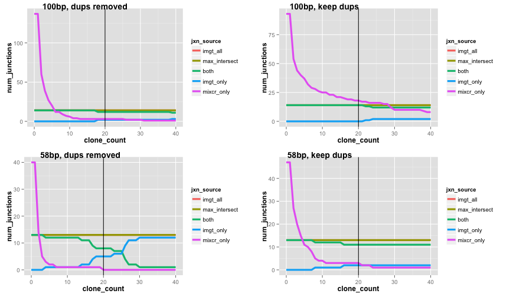

## From single cells to clonotypes

Some words and stuff!

<div style='text-align: center;'>
    
</div>


--- .class #id 


## Case 1: P85 MAIT

--- 

## Reading & formatting MiXCR outputs


```r
# Read, format, and filter MiXCR junctions
mixcr <- format_mixcr_jxns(mixcr_file) %>% 
    filter_mixcr_jxns() %>% 
    list(jxns = .)
```

<table>
 <thead>
  <tr>
   <th style="text-align:left;"> lib_id </th>
   <th style="text-align:right;"> cln_count </th>
   <th style="text-align:left;"> v_gene </th>
   <th style="text-align:right;"> v_gene_score </th>
   <th style="text-align:left;"> j_gene </th>
   <th style="text-align:right;"> j_gene_score </th>
   <th style="text-align:left;"> junction </th>
  </tr>
 </thead>
<tbody>
  <tr>
   <td style="text-align:left;"> lib3635 </td>
   <td style="text-align:right;"> 2 </td>
   <td style="text-align:left;"> TRAV8-7 </td>
   <td style="text-align:right;"> 67 </td>
   <td style="text-align:left;"> TRAJ19 </td>
   <td style="text-align:right;"> 55 </td>
   <td style="text-align:left;"> CAGADRLQTGMRGAF </td>
  </tr>
  <tr>
   <td style="text-align:left;"> lib3636 </td>
   <td style="text-align:right;"> 8 </td>
   <td style="text-align:left;"> TRAV24 </td>
   <td style="text-align:right;"> 80 </td>
   <td style="text-align:left;"> TRAJ7 </td>
   <td style="text-align:right;"> 41 </td>
   <td style="text-align:left;"> CAFIFRIWSKELYSNF </td>
  </tr>
  <tr>
   <td style="text-align:left;"> lib3636 </td>
   <td style="text-align:right;"> 3 </td>
   <td style="text-align:left;"> TRAV8-7 </td>
   <td style="text-align:right;"> 44 </td>
   <td style="text-align:left;"> TRAJ19 </td>
   <td style="text-align:right;"> 36 </td>
   <td style="text-align:left;"> CAGADRLQTGMRGAF </td>
  </tr>
  <tr>
   <td style="text-align:left;"> lib3636 </td>
   <td style="text-align:right;"> 1 </td>
   <td style="text-align:left;"> TRBV19 </td>
   <td style="text-align:right;"> 74 </td>
   <td style="text-align:left;"> TRAJ51 </td>
   <td style="text-align:right;"> 50 </td>
   <td style="text-align:left;"> CGQLYLKPLSDFPV </td>
  </tr>
  <tr>
   <td style="text-align:left;"> lib3637 </td>
   <td style="text-align:right;"> 190 </td>
   <td style="text-align:left;"> TRBV6-1 </td>
   <td style="text-align:right;"> 164 </td>
   <td style="text-align:left;"> TRBJ2-7 </td>
   <td style="text-align:right;"> 133 </td>
   <td style="text-align:left;"> CASSEGDSGGYEQYF </td>
  </tr>
  <tr>
   <td style="text-align:left;"> lib3637 </td>
   <td style="text-align:right;"> 5 </td>
   <td style="text-align:left;"> TRAV8-7 </td>
   <td style="text-align:right;"> 40 </td>
   <td style="text-align:left;"> TRAJ19 </td>
   <td style="text-align:right;"> 33 </td>
   <td style="text-align:left;"> CAGADRLQTGMRGAF </td>
  </tr>
</tbody>
</table>

--- 

## Inspecting MiXCR junctions

 

--- 

## Reading & formatting IMGT outputs


```r
# Read and filter IMGT junctions
imgt_file <- "data/P85/P85_MAIT/complied_P85_Prilic_1_and_2_productive_trimmed_unique.txt"

imgt <- format_imgt_jxns(imgt_file) %>% 
    filter_imgt_jxns() %>% 
    filter(!str_detect(lib_id, "lib2.*")) %>% 
    list(jxns = .)
```

<table>
 <thead>
  <tr>
   <th style="text-align:left;"> lib_id </th>
   <th style="text-align:left;"> v_gene </th>
   <th style="text-align:left;"> j_gene </th>
   <th style="text-align:left;"> junction </th>
  </tr>
 </thead>
<tbody>
  <tr>
   <td style="text-align:left;"> lib3637 </td>
   <td style="text-align:left;"> TRBV6-1 </td>
   <td style="text-align:left;"> TRBJ2-7 </td>
   <td style="text-align:left;"> CASSEGDSGGYEQYF </td>
  </tr>
  <tr>
   <td style="text-align:left;"> lib3638 </td>
   <td style="text-align:left;"> TRBV20-1 </td>
   <td style="text-align:left;"> TRBJ2-5 </td>
   <td style="text-align:left;"> CSAPTGDSETQYF </td>
  </tr>
  <tr>
   <td style="text-align:left;"> lib3639 </td>
   <td style="text-align:left;"> TRAV4 </td>
   <td style="text-align:left;"> TRAJ10 </td>
   <td style="text-align:left;"> CLVGVFTGGGNKLTF </td>
  </tr>
  <tr>
   <td style="text-align:left;"> lib3642 </td>
   <td style="text-align:left;"> TRAV1-2 </td>
   <td style="text-align:left;"> TRAJ33 </td>
   <td style="text-align:left;"> CAVMDSNYQLIW </td>
  </tr>
  <tr>
   <td style="text-align:left;"> lib3642 </td>
   <td style="text-align:left;"> TRBV6-4 </td>
   <td style="text-align:left;"> TRBJ2-3 </td>
   <td style="text-align:left;"> CASSPAGGTDTQYF </td>
  </tr>
  <tr>
   <td style="text-align:left;"> lib3644 </td>
   <td style="text-align:left;"> TRBV6-1 </td>
   <td style="text-align:left;"> TRBJ1-1 </td>
   <td style="text-align:left;"> CASSDDPGSSTEAFF </td>
  </tr>
</tbody>
</table>

--- 

## Comparing IMGT & MiXCR

 

--- 

## Checking for user variability

 

--- 

## Investigating the effect of RNA-seq parameters

Bonus function: `compile_imgt_output()`


--- 

## Plotting the results

 

---

## Case 2: P91

---

## MiXCR (with short reads) vs. IMGT


---

## Constructing & inspecting TCRs


```r
# Combine TRAV and TRBV junctions to construct TCRs
p91_imgt[["tcrs"]] <- p91_imgt$jxns %>% 
    construct_tcrs()
```

<table>
 <thead>
  <tr>
   <th style="text-align:left;"> lib_id </th>
   <th style="text-align:left;"> trav_gene </th>
   <th style="text-align:left;"> trav_jxn </th>
   <th style="text-align:left;"> trbv_gene </th>
   <th style="text-align:left;"> trbv_jxn </th>
  </tr>
 </thead>
<tbody>
  <tr>
   <td style="text-align:left;"> lib8472 </td>
   <td style="text-align:left;"> TRAV25 </td>
   <td style="text-align:left;"> CAGQTGANNLFF </td>
   <td style="text-align:left;"> TRBV4-3 </td>
   <td style="text-align:left;"> CASSQEVGTVPNQPQHF </td>
  </tr>
  <tr>
   <td style="text-align:left;"> lib8474 </td>
   <td style="text-align:left;"> TRAV12-3 </td>
   <td style="text-align:left;"> CAMSRILTGGGNKLTF </td>
   <td style="text-align:left;"> TRBV7-2 </td>
   <td style="text-align:left;"> CASSFPSSPLHF </td>
  </tr>
  <tr>
   <td style="text-align:left;"> lib8451 </td>
   <td style="text-align:left;"> TRAV25 </td>
   <td style="text-align:left;"> CAGQTGANNLFF </td>
   <td style="text-align:left;"> TRBV4-3 </td>
   <td style="text-align:left;"> CASSQEVGTVPNQPQHF </td>
  </tr>
  <tr>
   <td style="text-align:left;"> lib8453 </td>
   <td style="text-align:left;"> TRAV16 </td>
   <td style="text-align:left;"> CALLKGSGAGSYQLTF </td>
   <td style="text-align:left;"> TRBV20-1 </td>
   <td style="text-align:left;"> CSAPRGASGGSSYNEQFF </td>
  </tr>
  <tr>
   <td style="text-align:left;"> lib8493 </td>
   <td style="text-align:left;"> TRAV8-4 </td>
   <td style="text-align:left;"> CAVYGGATNKLIF </td>
   <td style="text-align:left;"> TRBV5-1 </td>
   <td style="text-align:left;"> CASSLDPGPNEQFF </td>
  </tr>
  <tr>
   <td style="text-align:left;"> lib8444 </td>
   <td style="text-align:left;"> TRAV26-2 </td>
   <td style="text-align:left;"> CILRDTISNFGNEKLTF </td>
   <td style="text-align:left;"> TRBV7-9 </td>
   <td style="text-align:left;"> CASSFGSSYYGYTF </td>
  </tr>
</tbody>
</table>

---

## Constructing TCRs with MiXCR - selecting junctions 


```r
p91_mixcr[["tcrs"]] <- p91_mixcr$jxns %>% 
    select_top_jxns() %>% 
    construct_tcrs()
```

<table>
 <thead>
  <tr>
   <th style="text-align:left;"> lib_id </th>
   <th style="text-align:left;"> trav_gene </th>
   <th style="text-align:left;"> trav_jxn </th>
   <th style="text-align:left;"> trbv_gene </th>
   <th style="text-align:left;"> trbv_jxn </th>
  </tr>
 </thead>
<tbody>
  <tr>
   <td style="text-align:left;"> lib8443 </td>
   <td style="text-align:left;"> TRAV8-7 </td>
   <td style="text-align:left;"> CAGADRLQTGMRGAF </td>
   <td style="text-align:left;"> TRBV7-8 </td>
   <td style="text-align:left;"> CASSATGEPQHF </td>
  </tr>
  <tr>
   <td style="text-align:left;"> lib8443 </td>
   <td style="text-align:left;"> TRAV13-2 </td>
   <td style="text-align:left;"> CALSSFMF </td>
   <td style="text-align:left;"> TRBV7-8 </td>
   <td style="text-align:left;"> CASSATGEPQHF </td>
  </tr>
  <tr>
   <td style="text-align:left;"> lib8444 </td>
   <td style="text-align:left;"> TRAV26-2 </td>
   <td style="text-align:left;"> CILRDTISNFGNEKLTF </td>
   <td style="text-align:left;"> TRBV11-1 </td>
   <td style="text-align:left;"> CASSFGSSYYGYTF </td>
  </tr>
  <tr>
   <td style="text-align:left;"> lib8444 </td>
   <td style="text-align:left;"> TRAV8-7 </td>
   <td style="text-align:left;"> CAGADRLQTGMRGAF </td>
   <td style="text-align:left;"> TRBV11-1 </td>
   <td style="text-align:left;"> CASSFGSSYYGYTF </td>
  </tr>
  <tr>
   <td style="text-align:left;"> lib8445 </td>
   <td style="text-align:left;"> TRAV26-2 </td>
   <td style="text-align:left;"> CILRDTISNFGNEKLTF </td>
   <td style="text-align:left;"> TRBV11-1 </td>
   <td style="text-align:left;"> CASSFGSSYYGYTF </td>
  </tr>
  <tr>
   <td style="text-align:left;"> lib8445 </td>
   <td style="text-align:left;"> TRAV12-3 </td>
   <td style="text-align:left;"> CAMNNENARLLTF </td>
   <td style="text-align:left;"> TRBV11-1 </td>
   <td style="text-align:left;"> CASSFGSSYYGYTF </td>
  </tr>
</tbody>
</table>

---

## Visualizing TCRs with Sankey diagrams


```r
# setwd("/Users/jaeddy/code/github/presentations/labMtg_dec2015/")
# Combine IMGT and MiXCR TCRs
imgt_mixcr <- p91_imgt$tcrs %>% 
    mutate(tcr_source = "IMGT") %>% 
    bind_rows(p91_mixcr$tcrs %>% 
                  mutate(tcr_source = "MiXCR")) %>% 
    list(tcrs = .)

# Construct and display a sankey network linking libs to genes to junctions
imgt_mixcr[["plot"]] <- 
    build_sankey_network(imgt_mixcr$tcrs, 
                         chain = "both") %>% 
    build_sankey_plot(sankey_height = 550)
```

---

## Sankey again...


<div id = 'chart3f9d71626512' class = 'rChart d3_sankey'></div>
<!--Attribution:
Mike Bostock https://github.com/d3/d3-plugins/tree/master/sankey
Mike Bostock http://bost.ocks.org/mike/sankey/
-->

<script>
(function(){
var params = {
 "dom": "chart3f9d71626512",
"width":    800,
"height":    550,
"data": {
 "source": [ "lib8472", "lib8474", "lib8451", "lib8453", "lib8493", "lib8444", "lib8445", "lib8482", "lib8485", "lib8488", "lib8464", "lib8467", "lib8449", "lib8445", "lib8449", "lib8451", "lib8462", "lib8464", "lib8467", "lib8474", "lib8480", "lib8482", "lib8488", "lib8493", "lib8472", "lib8474", "lib8451", "lib8453", "lib8493", "lib8444", "lib8445", "lib8482", "lib8485", "lib8488", "lib8464", "lib8467", "lib8449", "lib8445", "lib8449", "lib8451", "lib8462", "lib8464", "lib8467", "lib8474", "lib8480", "lib8482", "lib8488", "lib8493", "TRAV25", "TRAV12-3", "TRAV25", "TRAV16", "TRAV8-4", "TRAV26-2", "TRAV26-2", "TRAV25", "TRAV26-1", "TRAV10", "TRAV25", "TRAV26-2", "TRAV26-2", "TRAV26-2", "TRAV26-2", "TRAV25", "TRAV8-7", "TRAV25", "TRAV26-2", "TRAV12-3", "TRAV12-3", "TRAV25", "TRAV10", "TRAV8-4", "TRBV4-3", "TRBV7-2", "TRBV4-3", "TRBV20-1", "TRBV5-1", "TRBV7-9", "TRBV7-9", "TRBV4-3", "TRBV18", "TRBV25-1", "TRBV4-3", "TRBV7-9", "TRBV7-9", "TRBV11-1", "TRBV11-1", "TRBV4-3", "TRBV9", "TRBV12-1", "TRBV11-1", "TRBV11-3", "TRBV6-3", "TRBV4-3", "TRBV25-1", "TRBV5-1" ],
"target": [ "TRAV25", "TRAV12-3", "TRAV25", "TRAV16", "TRAV8-4", "TRAV26-2", "TRAV26-2", "TRAV25", "TRAV26-1", "TRAV10", "TRAV25", "TRAV26-2", "TRAV26-2", "TRAV26-2", "TRAV26-2", "TRAV25", "TRAV8-7", "TRAV25", "TRAV26-2", "TRAV12-3", "TRAV12-3", "TRAV25", "TRAV10", "TRAV8-4", "TRBV4-3", "TRBV7-2", "TRBV4-3", "TRBV20-1", "TRBV5-1", "TRBV7-9", "TRBV7-9", "TRBV4-3", "TRBV18", "TRBV25-1", "TRBV4-3", "TRBV7-9", "TRBV7-9", "TRBV11-1", "TRBV11-1", "TRBV4-3", "TRBV9", "TRBV12-1", "TRBV11-1", "TRBV11-3", "TRBV6-3", "TRBV4-3", "TRBV25-1", "TRBV5-1", "CAGQTGANNLFF", "CAMSRILTGGGNKLTF", "CAGQTGANNLFF", "CALLKGSGAGSYQLTF", "CAVYGGATNKLIF", "CILRDTISNFGNEKLTF", "CILRDTISNFGNEKLTF", "CAGQTGANNLFF", "CIVRVGESGGGADGLTF", "CVVSDRGSTLGRLYF", "CAGQTGANNLFF", "CILRDTISNFGNEKLTF", "CILRDTISNFGNEKLTF", "CILRDTISNFGNEKLTF", "CILRDTISNFGNEKLTF", "CAGQTGANNLFF", "CAGADRLQTGMRGAF", "CAGQTGANNLFF", "CILRDTISNFGNEKLTF", "CAMSRILTGGGNKLTF", "CAMNNENARLLTF", "CAGQTGANNLFF", "CVVSDRGSTLGRLYF", "CAVYGGATNKLIF", "CASSQEVGTVPNQPQHF", "CASSFPSSPLHF", "CASSQEVGTVPNQPQHF", "CSAPRGASGGSSYNEQFF", "CASSLDPGPNEQFF", "CASSFGSSYYGYTF", "CASSFGSSYYGYTF", "CASSQEVGTVPNQPQHF", "CASSRIQGAQGYTF", "CASSEPLAGVNNEQFF", "CASSQEVGTVPNQPQHF", "CASSFGSSYYGYTF", "CASSFGSSYYGYTF", "CASSFGSSYYGYTF", "CASSFGSSYYGYTF", "CASSQEVGTVPNQPQHF", "CASSTRQNQPQHF", "CEKHNFVF", "CASSFGSSYYGYTF", "CASSFPSSPLHF", "CASRSTGTGGAYGYTF", "CASSQEVGTVPNQPQHF", "CASSEPLAGVNNEQFF", "CASSLDPGPNEQFF" ],
"value": [ 8472.1, 8474.1, 8451.1, 8453.1, 8493.1, 8444.1, 8445.1, 8482.1, 8485.1, 8488.1, 8464.1, 8467.1, 8449.1, 8445.2, 8449.2, 8451.2, 8462.2, 8464.2, 8467.2, 8474.2, 8480.2, 8482.2, 8488.2, 8493.2, 8472.1, 8474.1, 8451.1, 8453.1, 8493.1, 8444.1, 8445.1, 8482.1, 8485.1, 8488.1, 8464.1, 8467.1, 8449.1, 8445.2, 8449.2, 8451.2, 8462.2, 8464.2, 8467.2, 8474.2, 8480.2, 8482.2, 8488.2, 8493.2, 8472.1, 8474.1, 8451.1, 8453.1, 8493.1, 8444.1, 8445.1, 8482.1, 8485.1, 8488.1, 8464.1, 8467.1, 8449.1, 8445.2, 8449.2, 8451.2, 8462.2, 8464.2, 8467.2, 8474.2, 8480.2, 8482.2, 8488.2, 8493.2, 8472.1, 8474.1, 8451.1, 8453.1, 8493.1, 8444.1, 8445.1, 8482.1, 8485.1, 8488.1, 8464.1, 8467.1, 8449.1, 8445.2, 8449.2, 8451.2, 8462.2, 8464.2, 8467.2, 8474.2, 8480.2, 8482.2, 8488.2, 8493.2 ] 
},
"nodeWidth":     15,
"nodePadding":     10,
"layout":     32,
"id": "chart3f9d71626512" 
};

params.units ? units = " " + params.units : units = "";

//hard code these now but eventually make available
var formatNumber = d3.format("0.1f"),    // zero decimal places
    format = function(d) { return formatNumber(d) + units; },
    color = d3.scale.category20();

if(params.labelFormat){
  formatNumber = d3.format(".2%");
}

var svg = d3.select('#' + params.id).append("svg")
    .attr("width", params.width)
    .attr("height", params.height);

var sankey = d3.sankey()
    .nodeWidth(params.nodeWidth)
    .nodePadding(params.nodePadding)
    .layout(params.layout)
    .size([params.width,params.height]);

var path = sankey.link();

var data = params.data,
    links = [],
    nodes = [];

//get all source and target into nodes
//will reduce to unique in the next step
//also get links in object form
data.source.forEach(function (d, i) {
    nodes.push({ "name": data.source[i] });
    nodes.push({ "name": data.target[i] });
    links.push({ "source": data.source[i], "target": data.target[i], "value": +data.value[i] });
});

//now get nodes based on links data
//thanks Mike Bostock https://groups.google.com/d/msg/d3-js/pl297cFtIQk/Eso4q_eBu1IJ
//this handy little function returns only the distinct / unique nodes
nodes = d3.keys(d3.nest()
                .key(function (d) { return d.name; })
                .map(nodes));

//it appears d3 with force layout wants a numeric source and target
//so loop through each link replacing the text with its index from node
links.forEach(function (d, i) {
    links[i].source = nodes.indexOf(links[i].source);
    links[i].target = nodes.indexOf(links[i].target);
});

//now loop through each nodes to make nodes an array of objects rather than an array of strings
nodes.forEach(function (d, i) {
    nodes[i] = { "name": d };
});

sankey
  .nodes(nodes)
  .links(links)
  .layout(params.layout);

var link = svg.append("g").selectAll(".link")
  .data(links)
.enter().append("path")
  .attr("class", "link")
  .attr("d", path)
  .style("stroke-width", function (d) { return Math.max(1, d.dy); })
  .style('stroke', function(d){
      if (format(d.value % 1) == 0.2) {
        return('#56B4E9');
      } else {
        return('#E69F00');
      }
    })
    .style('stroke-opacity', 0.5)
    .on('mouseover', function(d){
      d3.select(this)
        .style('stroke-opacity', 0.9)
    })
    .on('mouseout', function(d){
      d3.select(this)
        .style('stroke-opacity', 0.5)
    })
  .sort(function (a, b) {
      return (b.dy - a.dy);
  });

link.append("title")
  .text(function (d) {
      if (format(d.value % 1) == 0.2) {
          return d.source.name + " → " + d.target.name + "\nlib" + parseInt(format(d.value)) + " [MiXCR only]";
      } else {
          return d.source.name + " → " + d.target.name + "\nlib" + parseInt(format(d.value)) + " [Trinity+MiXCR]";
      }
  });

var node = svg.append("g").selectAll(".node")
  .data(nodes)
.enter().append("g")
  .attr("class", "node")
  .attr("transform", function (d) { return "translate(" + d.x + "," + d.y + ")"; })
.call(d3.behavior.drag()
  .origin(function (d) { return d; })
  .on("dragstart", function () { this.parentNode.appendChild(this); })
  .on("drag", dragmove));

node.append("rect")
  .attr("height", function (d) { return d.dy; })
  .attr("width", sankey.nodeWidth())
  .style("fill", "#666666") //function (d) { return d.color = color(d.name.replace(/ .*/, "")); })
  .style("stroke", "#333333") //function (d) { return d3.rgb(d.color).darker(2); })
.append("title")
  .text(function (d) { return d.name + "\n" + format(d.value); });

node.append("text")
  .attr("x", -6)
  .attr("y", function (d) { return d.dy / 2; })
  .attr("dy", ".35em")
  .attr("text-anchor", "end")
  .attr("transform", null)
  .text(function (d) { return d.name; })
.filter(function (d) { return d.x < params.width / 2; })
  .attr("x", 6 + sankey.nodeWidth())
  .attr("text-anchor", "start");

// the function for moving the nodes
  function dragmove(d) {
    d3.select(this).attr("transform",
        "translate(" + (
                   d.x = Math.max(0, Math.min(params.width - d.dx, d3.event.x))
                ) + "," + (
                   d.y = Math.max(0, Math.min(params.height - d.dy, d3.event.y))
                ) + ")");
        sankey.relayout();
        link.attr("d", path);
  }
})();
</script>

--- 

## B chain only


 

<div id = 'chart3f9ddda43d9' class = 'rChart d3_sankey'></div>
<!--Attribution:
Mike Bostock https://github.com/d3/d3-plugins/tree/master/sankey
Mike Bostock http://bost.ocks.org/mike/sankey/
-->

<script>
(function(){
var params = {
 "dom": "chart3f9ddda43d9",
"width":    800,
"height":    550,
"data": {
 "source": [ "lib8472", "lib8474", "lib8451", "lib8453", "lib8493", "lib8444", "lib8445", "lib8482", "lib8485", "lib8488", "lib8464", "lib8467", "lib8449", "lib8445", "lib8449", "lib8451", "lib8462", "lib8464", "lib8467", "lib8474", "lib8480", "lib8482", "lib8488", "lib8493", "TRBV4-3", "TRBV7-2", "TRBV4-3", "TRBV20-1", "TRBV5-1", "TRBV7-9", "TRBV7-9", "TRBV4-3", "TRBV18", "TRBV25-1", "TRBV4-3", "TRBV7-9", "TRBV7-9", "TRBV11-1", "TRBV11-1", "TRBV4-3", "TRBV9", "TRBV12-1", "TRBV11-1", "TRBV11-3", "TRBV6-3", "TRBV4-3", "TRBV25-1", "TRBV5-1" ],
"target": [ "TRBV4-3", "TRBV7-2", "TRBV4-3", "TRBV20-1", "TRBV5-1", "TRBV7-9", "TRBV7-9", "TRBV4-3", "TRBV18", "TRBV25-1", "TRBV4-3", "TRBV7-9", "TRBV7-9", "TRBV11-1", "TRBV11-1", "TRBV4-3", "TRBV9", "TRBV12-1", "TRBV11-1", "TRBV11-3", "TRBV6-3", "TRBV4-3", "TRBV25-1", "TRBV5-1", "CASSQEVGTVPNQPQHF", "CASSFPSSPLHF", "CASSQEVGTVPNQPQHF", "CSAPRGASGGSSYNEQFF", "CASSLDPGPNEQFF", "CASSFGSSYYGYTF", "CASSFGSSYYGYTF", "CASSQEVGTVPNQPQHF", "CASSRIQGAQGYTF", "CASSEPLAGVNNEQFF", "CASSQEVGTVPNQPQHF", "CASSFGSSYYGYTF", "CASSFGSSYYGYTF", "CASSFGSSYYGYTF", "CASSFGSSYYGYTF", "CASSQEVGTVPNQPQHF", "CASSTRQNQPQHF", "CEKHNFVF", "CASSFGSSYYGYTF", "CASSFPSSPLHF", "CASRSTGTGGAYGYTF", "CASSQEVGTVPNQPQHF", "CASSEPLAGVNNEQFF", "CASSLDPGPNEQFF" ],
"value": [ 8472.1, 8474.1, 8451.1, 8453.1, 8493.1, 8444.1, 8445.1, 8482.1, 8485.1, 8488.1, 8464.1, 8467.1, 8449.1, 8445.2, 8449.2, 8451.2, 8462.2, 8464.2, 8467.2, 8474.2, 8480.2, 8482.2, 8488.2, 8493.2, 8472.1, 8474.1, 8451.1, 8453.1, 8493.1, 8444.1, 8445.1, 8482.1, 8485.1, 8488.1, 8464.1, 8467.1, 8449.1, 8445.2, 8449.2, 8451.2, 8462.2, 8464.2, 8467.2, 8474.2, 8480.2, 8482.2, 8488.2, 8493.2 ] 
},
"nodeWidth":     15,
"nodePadding":     10,
"layout":     32,
"id": "chart3f9ddda43d9" 
};

params.units ? units = " " + params.units : units = "";

//hard code these now but eventually make available
var formatNumber = d3.format("0.1f"),    // zero decimal places
    format = function(d) { return formatNumber(d) + units; },
    color = d3.scale.category20();

if(params.labelFormat){
  formatNumber = d3.format(".2%");
}

var svg = d3.select('#' + params.id).append("svg")
    .attr("width", params.width)
    .attr("height", params.height);

var sankey = d3.sankey()
    .nodeWidth(params.nodeWidth)
    .nodePadding(params.nodePadding)
    .layout(params.layout)
    .size([params.width,params.height]);

var path = sankey.link();

var data = params.data,
    links = [],
    nodes = [];

//get all source and target into nodes
//will reduce to unique in the next step
//also get links in object form
data.source.forEach(function (d, i) {
    nodes.push({ "name": data.source[i] });
    nodes.push({ "name": data.target[i] });
    links.push({ "source": data.source[i], "target": data.target[i], "value": +data.value[i] });
});

//now get nodes based on links data
//thanks Mike Bostock https://groups.google.com/d/msg/d3-js/pl297cFtIQk/Eso4q_eBu1IJ
//this handy little function returns only the distinct / unique nodes
nodes = d3.keys(d3.nest()
                .key(function (d) { return d.name; })
                .map(nodes));

//it appears d3 with force layout wants a numeric source and target
//so loop through each link replacing the text with its index from node
links.forEach(function (d, i) {
    links[i].source = nodes.indexOf(links[i].source);
    links[i].target = nodes.indexOf(links[i].target);
});

//now loop through each nodes to make nodes an array of objects rather than an array of strings
nodes.forEach(function (d, i) {
    nodes[i] = { "name": d };
});

sankey
  .nodes(nodes)
  .links(links)
  .layout(params.layout);

var link = svg.append("g").selectAll(".link")
  .data(links)
.enter().append("path")
  .attr("class", "link")
  .attr("d", path)
  .style("stroke-width", function (d) { return Math.max(1, d.dy); })
  .style('stroke', function(d){
      if (format(d.value % 1) == 0.2) {
        return('#56B4E9');
      } else {
        return('#E69F00');
      }
    })
    .style('stroke-opacity', 0.5)
    .on('mouseover', function(d){
      d3.select(this)
        .style('stroke-opacity', 0.9)
    })
    .on('mouseout', function(d){
      d3.select(this)
        .style('stroke-opacity', 0.5)
    })
  .sort(function (a, b) {
      return (b.dy - a.dy);
  });

link.append("title")
  .text(function (d) {
      if (format(d.value % 1) == 0.2) {
          return d.source.name + " → " + d.target.name + "\nlib" + parseInt(format(d.value)) + " [MiXCR only]";
      } else {
          return d.source.name + " → " + d.target.name + "\nlib" + parseInt(format(d.value)) + " [Trinity+MiXCR]";
      }
  });

var node = svg.append("g").selectAll(".node")
  .data(nodes)
.enter().append("g")
  .attr("class", "node")
  .attr("transform", function (d) { return "translate(" + d.x + "," + d.y + ")"; })
.call(d3.behavior.drag()
  .origin(function (d) { return d; })
  .on("dragstart", function () { this.parentNode.appendChild(this); })
  .on("drag", dragmove));

node.append("rect")
  .attr("height", function (d) { return d.dy; })
  .attr("width", sankey.nodeWidth())
  .style("fill", "#666666") //function (d) { return d.color = color(d.name.replace(/ .*/, "")); })
  .style("stroke", "#333333") //function (d) { return d3.rgb(d.color).darker(2); })
.append("title")
  .text(function (d) { return d.name + "\n" + format(d.value); });

node.append("text")
  .attr("x", -6)
  .attr("y", function (d) { return d.dy / 2; })
  .attr("dy", ".35em")
  .attr("text-anchor", "end")
  .attr("transform", null)
  .text(function (d) { return d.name; })
.filter(function (d) { return d.x < params.width / 2; })
  .attr("x", 6 + sankey.nodeWidth())
  .attr("text-anchor", "start");

// the function for moving the nodes
  function dragmove(d) {
    d3.select(this).attr("transform",
        "translate(" + (
                   d.x = Math.max(0, Math.min(params.width - d.dx, d3.event.x))
                ) + "," + (
                   d.y = Math.max(0, Math.min(params.height - d.dy, d3.event.y))
                ) + ")");
        sankey.relayout();
        link.attr("d", path);
  }
})();
</script>

--- 

## Differences only


<div id = 'chart3f9d4e2fe295' class = 'rChart d3_sankey'></div>
<!--Attribution:
Mike Bostock https://github.com/d3/d3-plugins/tree/master/sankey
Mike Bostock http://bost.ocks.org/mike/sankey/
-->

<script>
(function(){
var params = {
 "dom": "chart3f9d4e2fe295",
"width":    800,
"height":    550,
"data": {
 "source": [ "lib8449", "lib8467", "lib8464", "lib8485", "lib8445", "lib8444", "lib8453", "lib8474", "lib8472", "lib8480", "lib8474", "lib8467", "lib8464", "lib8462", "lib8449", "lib8445", "TRBV7-9", "TRBV7-9", "TRBV4-3", "TRBV18", "TRBV7-9", "TRBV7-9", "TRBV20-1", "TRBV7-2", "TRBV4-3", "TRBV6-3", "TRBV11-3", "TRBV11-1", "TRBV12-1", "TRBV9", "TRBV11-1", "TRBV11-1" ],
"target": [ "TRBV7-9", "TRBV7-9", "TRBV4-3", "TRBV18", "TRBV7-9", "TRBV7-9", "TRBV20-1", "TRBV7-2", "TRBV4-3", "TRBV6-3", "TRBV11-3", "TRBV11-1", "TRBV12-1", "TRBV9", "TRBV11-1", "TRBV11-1", "CASSFGSSYYGYTF", "CASSFGSSYYGYTF", "CASSQEVGTVPNQPQHF", "CASSRIQGAQGYTF", "CASSFGSSYYGYTF", "CASSFGSSYYGYTF", "CSAPRGASGGSSYNEQFF", "CASSFPSSPLHF", "CASSQEVGTVPNQPQHF", "CASRSTGTGGAYGYTF", "CASSFPSSPLHF", "CASSFGSSYYGYTF", "CEKHNFVF", "CASSTRQNQPQHF", "CASSFGSSYYGYTF", "CASSFGSSYYGYTF" ],
"value": [ 8449.1, 8467.1, 8464.1, 8485.1, 8445.1, 8444.1, 8453.1, 8474.1, 8472.1, 8480.2, 8474.2, 8467.2, 8464.2, 8462.2, 8449.2, 8445.2, 8449.1, 8467.1, 8464.1, 8485.1, 8445.1, 8444.1, 8453.1, 8474.1, 8472.1, 8480.2, 8474.2, 8467.2, 8464.2, 8462.2, 8449.2, 8445.2 ] 
},
"nodeWidth":     15,
"nodePadding":     10,
"layout":     32,
"id": "chart3f9d4e2fe295" 
};

params.units ? units = " " + params.units : units = "";

//hard code these now but eventually make available
var formatNumber = d3.format("0.1f"),    // zero decimal places
    format = function(d) { return formatNumber(d) + units; },
    color = d3.scale.category20();

if(params.labelFormat){
  formatNumber = d3.format(".2%");
}

var svg = d3.select('#' + params.id).append("svg")
    .attr("width", params.width)
    .attr("height", params.height);

var sankey = d3.sankey()
    .nodeWidth(params.nodeWidth)
    .nodePadding(params.nodePadding)
    .layout(params.layout)
    .size([params.width,params.height]);

var path = sankey.link();

var data = params.data,
    links = [],
    nodes = [];

//get all source and target into nodes
//will reduce to unique in the next step
//also get links in object form
data.source.forEach(function (d, i) {
    nodes.push({ "name": data.source[i] });
    nodes.push({ "name": data.target[i] });
    links.push({ "source": data.source[i], "target": data.target[i], "value": +data.value[i] });
});

//now get nodes based on links data
//thanks Mike Bostock https://groups.google.com/d/msg/d3-js/pl297cFtIQk/Eso4q_eBu1IJ
//this handy little function returns only the distinct / unique nodes
nodes = d3.keys(d3.nest()
                .key(function (d) { return d.name; })
                .map(nodes));

//it appears d3 with force layout wants a numeric source and target
//so loop through each link replacing the text with its index from node
links.forEach(function (d, i) {
    links[i].source = nodes.indexOf(links[i].source);
    links[i].target = nodes.indexOf(links[i].target);
});

//now loop through each nodes to make nodes an array of objects rather than an array of strings
nodes.forEach(function (d, i) {
    nodes[i] = { "name": d };
});

sankey
  .nodes(nodes)
  .links(links)
  .layout(params.layout);

var link = svg.append("g").selectAll(".link")
  .data(links)
.enter().append("path")
  .attr("class", "link")
  .attr("d", path)
  .style("stroke-width", function (d) { return Math.max(1, d.dy); })
  .style('stroke', function(d){
      if (format(d.value % 1) == 0.2) {
        return('#56B4E9');
      } else {
        return('#E69F00');
      }
    })
    .style('stroke-opacity', 0.5)
    .on('mouseover', function(d){
      d3.select(this)
        .style('stroke-opacity', 0.9)
    })
    .on('mouseout', function(d){
      d3.select(this)
        .style('stroke-opacity', 0.5)
    })
  .sort(function (a, b) {
      return (b.dy - a.dy);
  });

link.append("title")
  .text(function (d) {
      if (format(d.value % 1) == 0.2) {
          return d.source.name + " → " + d.target.name + "\nlib" + parseInt(format(d.value)) + " [MiXCR only]";
      } else {
          return d.source.name + " → " + d.target.name + "\nlib" + parseInt(format(d.value)) + " [Trinity+MiXCR]";
      }
  });

var node = svg.append("g").selectAll(".node")
  .data(nodes)
.enter().append("g")
  .attr("class", "node")
  .attr("transform", function (d) { return "translate(" + d.x + "," + d.y + ")"; })
.call(d3.behavior.drag()
  .origin(function (d) { return d; })
  .on("dragstart", function () { this.parentNode.appendChild(this); })
  .on("drag", dragmove));

node.append("rect")
  .attr("height", function (d) { return d.dy; })
  .attr("width", sankey.nodeWidth())
  .style("fill", "#666666") //function (d) { return d.color = color(d.name.replace(/ .*/, "")); })
  .style("stroke", "#333333") //function (d) { return d3.rgb(d.color).darker(2); })
.append("title")
  .text(function (d) { return d.name + "\n" + format(d.value); });

node.append("text")
  .attr("x", -6)
  .attr("y", function (d) { return d.dy / 2; })
  .attr("dy", ".35em")
  .attr("text-anchor", "end")
  .attr("transform", null)
  .text(function (d) { return d.name; })
.filter(function (d) { return d.x < params.width / 2; })
  .attr("x", 6 + sankey.nodeWidth())
  .attr("text-anchor", "start");

// the function for moving the nodes
  function dragmove(d) {
    d3.select(this).attr("transform",
        "translate(" + (
                   d.x = Math.max(0, Math.min(params.width - d.dx, d3.event.x))
                ) + "," + (
                   d.y = Math.max(0, Math.min(params.height - d.dy, d3.event.y))
                ) + ")");
        sankey.relayout();
        link.attr("d", path);
  }
})();
</script>

--- 

## MiXCR with Trinity


```r
p91_mixcr_trinity[["tcrs"]] <- p91_mixcr_trinity$jxns %>% 
    select_top_jxns() %>% 
    construct_tcrs()
```

--- 

## How'd we do?


<div id = 'chart3f9db766176' class = 'rChart d3_sankey'></div>
<!--Attribution:
Mike Bostock https://github.com/d3/d3-plugins/tree/master/sankey
Mike Bostock http://bost.ocks.org/mike/sankey/
-->

<script>
(function(){
var params = {
 "dom": "chart3f9db766176",
"width":    800,
"height":    550,
"data": {
 "source": [ "lib8472", "lib8474", "lib8451", "lib8453", "lib8493", "lib8444", "lib8445", "lib8482", "lib8485", "lib8488", "lib8464", "lib8467", "lib8449", "lib8444", "lib8445", "lib8449", "lib8451", "lib8453", "lib8464", "lib8467", "lib8472", "lib8474", "lib8482", "lib8485", "lib8488", "lib8493", "TRBV4-3", "TRBV7-2", "TRBV4-3", "TRBV20-1", "TRBV5-1", "TRBV7-9", "TRBV7-9", "TRBV4-3", "TRBV18", "TRBV25-1", "TRBV4-3", "TRBV7-9", "TRBV7-9", "TRBV7-9", "TRBV7-9", "TRBV7-9", "TRBV4-3", "TRBV20-1", "TRBV4-3", "TRBV7-9", "TRBV4-3", "TRBV7-2", "TRBV4-3", "TRBV18", "TRBV25-1", "TRBV5-1" ],
"target": [ "TRBV4-3", "TRBV7-2", "TRBV4-3", "TRBV20-1", "TRBV5-1", "TRBV7-9", "TRBV7-9", "TRBV4-3", "TRBV18", "TRBV25-1", "TRBV4-3", "TRBV7-9", "TRBV7-9", "TRBV7-9", "TRBV7-9", "TRBV7-9", "TRBV4-3", "TRBV20-1", "TRBV4-3", "TRBV7-9", "TRBV4-3", "TRBV7-2", "TRBV4-3", "TRBV18", "TRBV25-1", "TRBV5-1", "CASSQEVGTVPNQPQHF", "CASSFPSSPLHF", "CASSQEVGTVPNQPQHF", "CSAPRGASGGSSYNEQFF", "CASSLDPGPNEQFF", "CASSFGSSYYGYTF", "CASSFGSSYYGYTF", "CASSQEVGTVPNQPQHF", "CASSRIQGAQGYTF", "CASSEPLAGVNNEQFF", "CASSQEVGTVPNQPQHF", "CASSFGSSYYGYTF", "CASSFGSSYYGYTF", "CASSFGSSYYGYTF", "CASSFGSSYYGYTF", "CASSFGSSYYGYTF", "CASSQEVGTVPNQPQHF", "CSAPRGASGGSSYNEQFF", "CASSQEVGTVPNQPQHF", "CASSFGSSYYGYTF", "CASSQEVGTVPNQPQHF", "CASSFPSSPLHF", "CASSQEVGTVPNQPQHF", "CASSRIQGAQGYTF", "CASSEPLAGVNNEQFF", "CASSLDPGPNEQFF" ],
"value": [ 8472.1, 8474.1, 8451.1, 8453.1, 8493.1, 8444.1, 8445.1, 8482.1, 8485.1, 8488.1, 8464.1, 8467.1, 8449.1, 8444.2, 8445.2, 8449.2, 8451.2, 8453.2, 8464.2, 8467.2, 8472.2, 8474.2, 8482.2, 8485.2, 8488.2, 8493.2, 8472.1, 8474.1, 8451.1, 8453.1, 8493.1, 8444.1, 8445.1, 8482.1, 8485.1, 8488.1, 8464.1, 8467.1, 8449.1, 8444.2, 8445.2, 8449.2, 8451.2, 8453.2, 8464.2, 8467.2, 8472.2, 8474.2, 8482.2, 8485.2, 8488.2, 8493.2 ] 
},
"nodeWidth":     15,
"nodePadding":     10,
"layout":     32,
"id": "chart3f9db766176" 
};

params.units ? units = " " + params.units : units = "";

//hard code these now but eventually make available
var formatNumber = d3.format("0.1f"),    // zero decimal places
    format = function(d) { return formatNumber(d) + units; },
    color = d3.scale.category20();

if(params.labelFormat){
  formatNumber = d3.format(".2%");
}

var svg = d3.select('#' + params.id).append("svg")
    .attr("width", params.width)
    .attr("height", params.height);

var sankey = d3.sankey()
    .nodeWidth(params.nodeWidth)
    .nodePadding(params.nodePadding)
    .layout(params.layout)
    .size([params.width,params.height]);

var path = sankey.link();

var data = params.data,
    links = [],
    nodes = [];

//get all source and target into nodes
//will reduce to unique in the next step
//also get links in object form
data.source.forEach(function (d, i) {
    nodes.push({ "name": data.source[i] });
    nodes.push({ "name": data.target[i] });
    links.push({ "source": data.source[i], "target": data.target[i], "value": +data.value[i] });
});

//now get nodes based on links data
//thanks Mike Bostock https://groups.google.com/d/msg/d3-js/pl297cFtIQk/Eso4q_eBu1IJ
//this handy little function returns only the distinct / unique nodes
nodes = d3.keys(d3.nest()
                .key(function (d) { return d.name; })
                .map(nodes));

//it appears d3 with force layout wants a numeric source and target
//so loop through each link replacing the text with its index from node
links.forEach(function (d, i) {
    links[i].source = nodes.indexOf(links[i].source);
    links[i].target = nodes.indexOf(links[i].target);
});

//now loop through each nodes to make nodes an array of objects rather than an array of strings
nodes.forEach(function (d, i) {
    nodes[i] = { "name": d };
});

sankey
  .nodes(nodes)
  .links(links)
  .layout(params.layout);

var link = svg.append("g").selectAll(".link")
  .data(links)
.enter().append("path")
  .attr("class", "link")
  .attr("d", path)
  .style("stroke-width", function (d) { return Math.max(1, d.dy); })
  .style('stroke', function(d){
      if (format(d.value % 1) == 0.2) {
        return('#56B4E9');
      } else {
        return('#E69F00');
      }
    })
    .style('stroke-opacity', 0.5)
    .on('mouseover', function(d){
      d3.select(this)
        .style('stroke-opacity', 0.9)
    })
    .on('mouseout', function(d){
      d3.select(this)
        .style('stroke-opacity', 0.5)
    })
  .sort(function (a, b) {
      return (b.dy - a.dy);
  });

link.append("title")
  .text(function (d) {
      if (format(d.value % 1) == 0.2) {
          return d.source.name + " → " + d.target.name + "\nlib" + parseInt(format(d.value)) + " [MiXCR only]";
      } else {
          return d.source.name + " → " + d.target.name + "\nlib" + parseInt(format(d.value)) + " [Trinity+MiXCR]";
      }
  });

var node = svg.append("g").selectAll(".node")
  .data(nodes)
.enter().append("g")
  .attr("class", "node")
  .attr("transform", function (d) { return "translate(" + d.x + "," + d.y + ")"; })
.call(d3.behavior.drag()
  .origin(function (d) { return d; })
  .on("dragstart", function () { this.parentNode.appendChild(this); })
  .on("drag", dragmove));

node.append("rect")
  .attr("height", function (d) { return d.dy; })
  .attr("width", sankey.nodeWidth())
  .style("fill", "#666666") //function (d) { return d.color = color(d.name.replace(/ .*/, "")); })
  .style("stroke", "#333333") //function (d) { return d3.rgb(d.color).darker(2); })
.append("title")
  .text(function (d) { return d.name + "\n" + format(d.value); });

node.append("text")
  .attr("x", -6)
  .attr("y", function (d) { return d.dy / 2; })
  .attr("dy", ".35em")
  .attr("text-anchor", "end")
  .attr("transform", null)
  .text(function (d) { return d.name; })
.filter(function (d) { return d.x < params.width / 2; })
  .attr("x", 6 + sankey.nodeWidth())
  .attr("text-anchor", "start");

// the function for moving the nodes
  function dragmove(d) {
    d3.select(this).attr("transform",
        "translate(" + (
                   d.x = Math.max(0, Math.min(params.width - d.dx, d3.event.x))
                ) + "," + (
                   d.y = Math.max(0, Math.min(params.height - d.dy, d3.event.y))
                ) + ")");
        sankey.relayout();
        link.attr("d", path);
  }
})();
</script>

--- 

## Checking all


<div id = 'chart3f9d34d720d8' class = 'rChart d3_sankey'></div>
<!--Attribution:
Mike Bostock https://github.com/d3/d3-plugins/tree/master/sankey
Mike Bostock http://bost.ocks.org/mike/sankey/
-->

<script>
(function(){
var params = {
 "dom": "chart3f9d34d720d8",
"width":    800,
"height":    550,
"data": {
 "source": [ "lib8472", "lib8474", "lib8451", "lib8453", "lib8493", "lib8444", "lib8445", "lib8482", "lib8485", "lib8488", "lib8464", "lib8467", "lib8449", "lib8444", "lib8445", "lib8449", "lib8451", "lib8453", "lib8464", "lib8467", "lib8472", "lib8474", "lib8482", "lib8485", "lib8488", "lib8493", "lib8472", "lib8474", "lib8451", "lib8453", "lib8493", "lib8444", "lib8445", "lib8482", "lib8485", "lib8488", "lib8464", "lib8467", "lib8449", "lib8444", "lib8445", "lib8449", "lib8451", "lib8453", "lib8464", "lib8467", "lib8472", "lib8474", "lib8482", "lib8485", "lib8488", "lib8493", "TRAV25", "TRAV12-3", "TRAV25", "TRAV16", "TRAV8-4", "TRAV26-2", "TRAV26-2", "TRAV25", "TRAV26-1", "TRAV10", "TRAV25", "TRAV26-2", "TRAV26-2", "TRAV26-2", "TRAV26-2", "TRAV26-2", "TRAV25", "TRAV16", "TRAV25", "TRAV26-2", "TRAV25", "TRAV12-3", "TRAV25", "TRAV26-1", "TRAV10", "TRAV8-4", "TRBV4-3", "TRBV7-2", "TRBV4-3", "TRBV20-1", "TRBV5-1", "TRBV7-9", "TRBV7-9", "TRBV4-3", "TRBV18", "TRBV25-1", "TRBV4-3", "TRBV7-9", "TRBV7-9", "TRBV7-9", "TRBV7-9", "TRBV7-9", "TRBV4-3", "TRBV20-1", "TRBV4-3", "TRBV7-9", "TRBV4-3", "TRBV7-2", "TRBV4-3", "TRBV18", "TRBV25-1", "TRBV5-1" ],
"target": [ "TRAV25", "TRAV12-3", "TRAV25", "TRAV16", "TRAV8-4", "TRAV26-2", "TRAV26-2", "TRAV25", "TRAV26-1", "TRAV10", "TRAV25", "TRAV26-2", "TRAV26-2", "TRAV26-2", "TRAV26-2", "TRAV26-2", "TRAV25", "TRAV16", "TRAV25", "TRAV26-2", "TRAV25", "TRAV12-3", "TRAV25", "TRAV26-1", "TRAV10", "TRAV8-4", "TRBV4-3", "TRBV7-2", "TRBV4-3", "TRBV20-1", "TRBV5-1", "TRBV7-9", "TRBV7-9", "TRBV4-3", "TRBV18", "TRBV25-1", "TRBV4-3", "TRBV7-9", "TRBV7-9", "TRBV7-9", "TRBV7-9", "TRBV7-9", "TRBV4-3", "TRBV20-1", "TRBV4-3", "TRBV7-9", "TRBV4-3", "TRBV7-2", "TRBV4-3", "TRBV18", "TRBV25-1", "TRBV5-1", "CAGQTGANNLFF", "CAMSRILTGGGNKLTF", "CAGQTGANNLFF", "CALLKGSGAGSYQLTF", "CAVYGGATNKLIF", "CILRDTISNFGNEKLTF", "CILRDTISNFGNEKLTF", "CAGQTGANNLFF", "CIVRVGESGGGADGLTF", "CVVSDRGSTLGRLYF", "CAGQTGANNLFF", "CILRDTISNFGNEKLTF", "CILRDTISNFGNEKLTF", "CILRDTISNFGNEKLTF", "CILRDTISNFGNEKLTF", "CILRDTISNFGNEKLTF", "CAGQTGANNLFF", "CALLKGSGAGSYQLTF", "CAGQTGANNLFF", "CILRDTISNFGNEKLTF", "CAGQTGANNLFF", "CAMSRILTGGGNKLTF", "CAGQTGANNLFF", "CIVRVGESGGGADGLTF", "CVVSDRGSTLGRLYF", "CAVYGGATNKLIF", "CASSQEVGTVPNQPQHF", "CASSFPSSPLHF", "CASSQEVGTVPNQPQHF", "CSAPRGASGGSSYNEQFF", "CASSLDPGPNEQFF", "CASSFGSSYYGYTF", "CASSFGSSYYGYTF", "CASSQEVGTVPNQPQHF", "CASSRIQGAQGYTF", "CASSEPLAGVNNEQFF", "CASSQEVGTVPNQPQHF", "CASSFGSSYYGYTF", "CASSFGSSYYGYTF", "CASSFGSSYYGYTF", "CASSFGSSYYGYTF", "CASSFGSSYYGYTF", "CASSQEVGTVPNQPQHF", "CSAPRGASGGSSYNEQFF", "CASSQEVGTVPNQPQHF", "CASSFGSSYYGYTF", "CASSQEVGTVPNQPQHF", "CASSFPSSPLHF", "CASSQEVGTVPNQPQHF", "CASSRIQGAQGYTF", "CASSEPLAGVNNEQFF", "CASSLDPGPNEQFF" ],
"value": [ 8472.1, 8474.1, 8451.1, 8453.1, 8493.1, 8444.1, 8445.1, 8482.1, 8485.1, 8488.1, 8464.1, 8467.1, 8449.1, 8444.2, 8445.2, 8449.2, 8451.2, 8453.2, 8464.2, 8467.2, 8472.2, 8474.2, 8482.2, 8485.2, 8488.2, 8493.2, 8472.1, 8474.1, 8451.1, 8453.1, 8493.1, 8444.1, 8445.1, 8482.1, 8485.1, 8488.1, 8464.1, 8467.1, 8449.1, 8444.2, 8445.2, 8449.2, 8451.2, 8453.2, 8464.2, 8467.2, 8472.2, 8474.2, 8482.2, 8485.2, 8488.2, 8493.2, 8472.1, 8474.1, 8451.1, 8453.1, 8493.1, 8444.1, 8445.1, 8482.1, 8485.1, 8488.1, 8464.1, 8467.1, 8449.1, 8444.2, 8445.2, 8449.2, 8451.2, 8453.2, 8464.2, 8467.2, 8472.2, 8474.2, 8482.2, 8485.2, 8488.2, 8493.2, 8472.1, 8474.1, 8451.1, 8453.1, 8493.1, 8444.1, 8445.1, 8482.1, 8485.1, 8488.1, 8464.1, 8467.1, 8449.1, 8444.2, 8445.2, 8449.2, 8451.2, 8453.2, 8464.2, 8467.2, 8472.2, 8474.2, 8482.2, 8485.2, 8488.2, 8493.2 ] 
},
"nodeWidth":     15,
"nodePadding":     10,
"layout":     32,
"id": "chart3f9d34d720d8" 
};

params.units ? units = " " + params.units : units = "";

//hard code these now but eventually make available
var formatNumber = d3.format("0.1f"),    // zero decimal places
    format = function(d) { return formatNumber(d) + units; },
    color = d3.scale.category20();

if(params.labelFormat){
  formatNumber = d3.format(".2%");
}

var svg = d3.select('#' + params.id).append("svg")
    .attr("width", params.width)
    .attr("height", params.height);

var sankey = d3.sankey()
    .nodeWidth(params.nodeWidth)
    .nodePadding(params.nodePadding)
    .layout(params.layout)
    .size([params.width,params.height]);

var path = sankey.link();

var data = params.data,
    links = [],
    nodes = [];

//get all source and target into nodes
//will reduce to unique in the next step
//also get links in object form
data.source.forEach(function (d, i) {
    nodes.push({ "name": data.source[i] });
    nodes.push({ "name": data.target[i] });
    links.push({ "source": data.source[i], "target": data.target[i], "value": +data.value[i] });
});

//now get nodes based on links data
//thanks Mike Bostock https://groups.google.com/d/msg/d3-js/pl297cFtIQk/Eso4q_eBu1IJ
//this handy little function returns only the distinct / unique nodes
nodes = d3.keys(d3.nest()
                .key(function (d) { return d.name; })
                .map(nodes));

//it appears d3 with force layout wants a numeric source and target
//so loop through each link replacing the text with its index from node
links.forEach(function (d, i) {
    links[i].source = nodes.indexOf(links[i].source);
    links[i].target = nodes.indexOf(links[i].target);
});

//now loop through each nodes to make nodes an array of objects rather than an array of strings
nodes.forEach(function (d, i) {
    nodes[i] = { "name": d };
});

sankey
  .nodes(nodes)
  .links(links)
  .layout(params.layout);

var link = svg.append("g").selectAll(".link")
  .data(links)
.enter().append("path")
  .attr("class", "link")
  .attr("d", path)
  .style("stroke-width", function (d) { return Math.max(1, d.dy); })
  .style('stroke', function(d){
      if (format(d.value % 1) == 0.2) {
        return('#56B4E9');
      } else {
        return('#E69F00');
      }
    })
    .style('stroke-opacity', 0.5)
    .on('mouseover', function(d){
      d3.select(this)
        .style('stroke-opacity', 0.9)
    })
    .on('mouseout', function(d){
      d3.select(this)
        .style('stroke-opacity', 0.5)
    })
  .sort(function (a, b) {
      return (b.dy - a.dy);
  });

link.append("title")
  .text(function (d) {
      if (format(d.value % 1) == 0.2) {
          return d.source.name + " → " + d.target.name + "\nlib" + parseInt(format(d.value)) + " [MiXCR only]";
      } else {
          return d.source.name + " → " + d.target.name + "\nlib" + parseInt(format(d.value)) + " [Trinity+MiXCR]";
      }
  });

var node = svg.append("g").selectAll(".node")
  .data(nodes)
.enter().append("g")
  .attr("class", "node")
  .attr("transform", function (d) { return "translate(" + d.x + "," + d.y + ")"; })
.call(d3.behavior.drag()
  .origin(function (d) { return d; })
  .on("dragstart", function () { this.parentNode.appendChild(this); })
  .on("drag", dragmove));

node.append("rect")
  .attr("height", function (d) { return d.dy; })
  .attr("width", sankey.nodeWidth())
  .style("fill", "#666666") //function (d) { return d.color = color(d.name.replace(/ .*/, "")); })
  .style("stroke", "#333333") //function (d) { return d3.rgb(d.color).darker(2); })
.append("title")
  .text(function (d) { return d.name + "\n" + format(d.value); });

node.append("text")
  .attr("x", -6)
  .attr("y", function (d) { return d.dy / 2; })
  .attr("dy", ".35em")
  .attr("text-anchor", "end")
  .attr("transform", null)
  .text(function (d) { return d.name; })
.filter(function (d) { return d.x < params.width / 2; })
  .attr("x", 6 + sankey.nodeWidth())
  .attr("text-anchor", "start");

// the function for moving the nodes
  function dragmove(d) {
    d3.select(this).attr("transform",
        "translate(" + (
                   d.x = Math.max(0, Math.min(params.width - d.dx, d3.event.x))
                ) + "," + (
                   d.y = Math.max(0, Math.min(params.height - d.dy, d3.event.y))
                ) + ")");
        sankey.relayout();
        link.attr("d", path);
  }
})();
</script>

---

## Case 3: P48


<div id = 'chart3f9d1c9bb8c' class = 'rChart d3_sankey'></div>
<!--Attribution:
Mike Bostock https://github.com/d3/d3-plugins/tree/master/sankey
Mike Bostock http://bost.ocks.org/mike/sankey/
-->

<script>
(function(){
var params = {
 "dom": "chart3f9d1c9bb8c",
"width":    800,
"height":    550,
"data": {
 "source": [ "lib2268", "lib2269", "lib2366", "lib2367", "lib2368", "lib2372", "lib2373", "lib2377", "lib2378", "lib2268", "lib2366", "lib2367", "lib2368", "lib2372", "lib2373", "lib2377", "lib2378", "lib2268", "lib2269", "lib2366", "lib2367", "lib2368", "lib2372", "lib2373", "lib2377", "lib2378", "lib2268", "lib2366", "lib2367", "lib2368", "lib2372", "lib2373", "lib2377", "lib2378", "TRAV19", "TRAV19", "TRAV8-3", "TRAV19", "TRAV8-3", "TRAV19", "TRAV19", "TRAV19", "TRAV8-3", "TRAV19", "TRAV19", "TRAV19", "TRAV19", "TRAV19", "TRAV19", "TRAV19", "TRAV19", "TRBV5-1", "TRBV5-1", "TRBV5-1", "TRBV5-1", "TRBV5-1", "TRBV5-1", "TRBV5-1", "TRBV5-1", "TRBV5-1", "TRBV5-1", "TRBV5-1", "TRBV5-1", "TRBV5-1", "TRBV5-1", "TRBV5-1", "TRBV5-1", "TRBV5-1" ],
"target": [ "TRAV19", "TRAV19", "TRAV8-3", "TRAV19", "TRAV8-3", "TRAV19", "TRAV19", "TRAV19", "TRAV8-3", "TRAV19", "TRAV19", "TRAV19", "TRAV19", "TRAV19", "TRAV19", "TRAV19", "TRAV19", "TRBV5-1", "TRBV5-1", "TRBV5-1", "TRBV5-1", "TRBV5-1", "TRBV5-1", "TRBV5-1", "TRBV5-1", "TRBV5-1", "TRBV5-1", "TRBV5-1", "TRBV5-1", "TRBV5-1", "TRBV5-1", "TRBV5-1", "TRBV5-1", "TRBV5-1", "CALSENRGGTASKLTF", "CALSENRGGTASKLTF", "CALQTGANNLFF", "CALSENRGGTASKLTF", "CALQTGANNLFF", "CALSENRGGTASKLTF", "CALSENRGGTASKLTF", "CALSENRGGTASKLTF", "CALQTGANNLFF", "CALSENRGGTASKLTF", "CALSENRGGTASKLTF", "CALSENRGGTASKLTF", "CALSENRGGTASKLTF", "CALSENRGGTASKLTF", "CALSENRGGTASKLTF", "CALSENRGGTASKLTF", "CALSENRGGTASKLTF", "CASSLVGGPSSEAFF", "CASSLVGGPSSEAFF", "CASSLVGGPSSEAFF", "CASSLVGGPSSEAFF", "CASSLVGGPSSEAFF", "CASSLVGGPSSEAFF", "CASSLVGGPSSEAFF", "CASSLVGGPSSEAFF", "CASSLVGGPSSEAFF", "CASSLVGGPSSEAFF", "CASSLVGGPSSEAFF", "CASSLVGGPSSEAFF", "CASSLVGGPSSEAFF", "CASSLVGGPSSEAFF", "CASSLVGGPSSEAFF", "CASSLVGGPSSEAFF", "CASSLVGGPSSEAFF" ],
"value": [ 2268.1, 2269.1, 2366.1, 2367.1, 2368.1, 2372.1, 2373.1, 2377.1, 2378.1, 2268.2, 2366.2, 2367.2, 2368.2, 2372.2, 2373.2, 2377.2, 2378.2, 2268.1, 2269.1, 2366.1, 2367.1, 2368.1, 2372.1, 2373.1, 2377.1, 2378.1, 2268.2, 2366.2, 2367.2, 2368.2, 2372.2, 2373.2, 2377.2, 2378.2, 2268.1, 2269.1, 2366.1, 2367.1, 2368.1, 2372.1, 2373.1, 2377.1, 2378.1, 2268.2, 2366.2, 2367.2, 2368.2, 2372.2, 2373.2, 2377.2, 2378.2, 2268.1, 2269.1, 2366.1, 2367.1, 2368.1, 2372.1, 2373.1, 2377.1, 2378.1, 2268.2, 2366.2, 2367.2, 2368.2, 2372.2, 2373.2, 2377.2, 2378.2 ] 
},
"nodeWidth":     15,
"nodePadding":     10,
"layout":     32,
"id": "chart3f9d1c9bb8c" 
};

params.units ? units = " " + params.units : units = "";

//hard code these now but eventually make available
var formatNumber = d3.format("0.1f"),    // zero decimal places
    format = function(d) { return formatNumber(d) + units; },
    color = d3.scale.category20();

if(params.labelFormat){
  formatNumber = d3.format(".2%");
}

var svg = d3.select('#' + params.id).append("svg")
    .attr("width", params.width)
    .attr("height", params.height);

var sankey = d3.sankey()
    .nodeWidth(params.nodeWidth)
    .nodePadding(params.nodePadding)
    .layout(params.layout)
    .size([params.width,params.height]);

var path = sankey.link();

var data = params.data,
    links = [],
    nodes = [];

//get all source and target into nodes
//will reduce to unique in the next step
//also get links in object form
data.source.forEach(function (d, i) {
    nodes.push({ "name": data.source[i] });
    nodes.push({ "name": data.target[i] });
    links.push({ "source": data.source[i], "target": data.target[i], "value": +data.value[i] });
});

//now get nodes based on links data
//thanks Mike Bostock https://groups.google.com/d/msg/d3-js/pl297cFtIQk/Eso4q_eBu1IJ
//this handy little function returns only the distinct / unique nodes
nodes = d3.keys(d3.nest()
                .key(function (d) { return d.name; })
                .map(nodes));

//it appears d3 with force layout wants a numeric source and target
//so loop through each link replacing the text with its index from node
links.forEach(function (d, i) {
    links[i].source = nodes.indexOf(links[i].source);
    links[i].target = nodes.indexOf(links[i].target);
});

//now loop through each nodes to make nodes an array of objects rather than an array of strings
nodes.forEach(function (d, i) {
    nodes[i] = { "name": d };
});

sankey
  .nodes(nodes)
  .links(links)
  .layout(params.layout);

var link = svg.append("g").selectAll(".link")
  .data(links)
.enter().append("path")
  .attr("class", "link")
  .attr("d", path)
  .style("stroke-width", function (d) { return Math.max(1, d.dy); })
  .style('stroke', function(d){
      if (format(d.value % 1) == 0.2) {
        return('#56B4E9');
      } else {
        return('#E69F00');
      }
    })
    .style('stroke-opacity', 0.5)
    .on('mouseover', function(d){
      d3.select(this)
        .style('stroke-opacity', 0.9)
    })
    .on('mouseout', function(d){
      d3.select(this)
        .style('stroke-opacity', 0.5)
    })
  .sort(function (a, b) {
      return (b.dy - a.dy);
  });

link.append("title")
  .text(function (d) {
      if (format(d.value % 1) == 0.2) {
          return d.source.name + " → " + d.target.name + "\nlib" + parseInt(format(d.value)) + " [MiXCR only]";
      } else {
          return d.source.name + " → " + d.target.name + "\nlib" + parseInt(format(d.value)) + " [Trinity+MiXCR]";
      }
  });

var node = svg.append("g").selectAll(".node")
  .data(nodes)
.enter().append("g")
  .attr("class", "node")
  .attr("transform", function (d) { return "translate(" + d.x + "," + d.y + ")"; })
.call(d3.behavior.drag()
  .origin(function (d) { return d; })
  .on("dragstart", function () { this.parentNode.appendChild(this); })
  .on("drag", dragmove));

node.append("rect")
  .attr("height", function (d) { return d.dy; })
  .attr("width", sankey.nodeWidth())
  .style("fill", "#666666") //function (d) { return d.color = color(d.name.replace(/ .*/, "")); })
  .style("stroke", "#333333") //function (d) { return d3.rgb(d.color).darker(2); })
.append("title")
  .text(function (d) { return d.name + "\n" + format(d.value); });

node.append("text")
  .attr("x", -6)
  .attr("y", function (d) { return d.dy / 2; })
  .attr("dy", ".35em")
  .attr("text-anchor", "end")
  .attr("transform", null)
  .text(function (d) { return d.name; })
.filter(function (d) { return d.x < params.width / 2; })
  .attr("x", 6 + sankey.nodeWidth())
  .attr("text-anchor", "start");

// the function for moving the nodes
  function dragmove(d) {
    d3.select(this).attr("transform",
        "translate(" + (
                   d.x = Math.max(0, Math.min(params.width - d.dx, d3.event.x))
                ) + "," + (
                   d.y = Math.max(0, Math.min(params.height - d.dy, d3.event.y))
                ) + ")");
        sankey.relayout();
        link.attr("d", path);
  }
})();
</script>

--- 

## Allowing multiple TRAV


<link rel='stylesheet' href=http://timelyportfolio.github.io/rCharts_d3_sankey/css/sankey.css>
<script type='text/javascript' src=http://d3js.org/d3.v3.min.js></script>
<script type='text/javascript' src=http://timelyportfolio.github.io/rCharts_d3_sankey/js/sankey.js></script> 
 <style>
  .rChart {
    display: block;
    margin-left: auto; 
    margin-right: auto;
    width: 800px;
    height: 550px;
  }  
  </style>
<div id = 'chart3f9d206fe729' class = 'rChart d3_sankey'></div>
<!--Attribution:
Mike Bostock https://github.com/d3/d3-plugins/tree/master/sankey
Mike Bostock http://bost.ocks.org/mike/sankey/
-->

<script>
(function(){
var params = {
 "dom": "chart3f9d206fe729",
"width":    800,
"height":    550,
"data": {
 "source": [ "lib2268", "lib2268", "lib2269", "lib2269", "lib2366", "lib2366", "lib2367", "lib2367", "lib2368", "lib2368", "lib2372", "lib2372", "lib2373", "lib2373", "lib2377", "lib2377", "lib2378", "lib2378", "lib2268", "lib2268", "lib2366", "lib2366", "lib2367", "lib2367", "lib2368", "lib2368", "lib2372", "lib2372", "lib2373", "lib2373", "lib2377", "lib2377", "lib2378", "lib2378", "lib2268", "lib2269", "lib2366", "lib2367", "lib2368", "lib2372", "lib2373", "lib2377", "lib2378", "lib2268", "lib2366", "lib2367", "lib2368", "lib2372", "lib2373", "lib2377", "lib2378", "TRAV19", "TRAV8-3", "TRAV19", "TRAV8-3", "TRAV8-3", "TRAV19", "TRAV19", "TRAV8-3", "TRAV8-3", "TRAV19", "TRAV19", "TRAV8-3", "TRAV19", "TRAV8-3", "TRAV19", "TRAV8-3", "TRAV8-3", "TRAV19", "TRAV19", "TRAV8-3", "TRAV19", "TRAV8-3", "TRAV19", "TRAV8-3", "TRAV19", "TRAV8-3", "TRAV19", "TRAV8-3", "TRAV19", "TRAV8-3", "TRAV19", "TRAV8-3", "TRAV19", "TRAV8-3", "TRBV5-1", "TRBV5-1", "TRBV5-1", "TRBV5-1", "TRBV5-1", "TRBV5-1", "TRBV5-1", "TRBV5-1", "TRBV5-1", "TRBV5-1", "TRBV5-1", "TRBV5-1", "TRBV5-1", "TRBV5-1", "TRBV5-1", "TRBV5-1", "TRBV5-1" ],
"target": [ "TRAV19", "TRAV8-3", "TRAV19", "TRAV8-3", "TRAV8-3", "TRAV19", "TRAV19", "TRAV8-3", "TRAV8-3", "TRAV19", "TRAV19", "TRAV8-3", "TRAV19", "TRAV8-3", "TRAV19", "TRAV8-3", "TRAV8-3", "TRAV19", "TRAV19", "TRAV8-3", "TRAV19", "TRAV8-3", "TRAV19", "TRAV8-3", "TRAV19", "TRAV8-3", "TRAV19", "TRAV8-3", "TRAV19", "TRAV8-3", "TRAV19", "TRAV8-3", "TRAV19", "TRAV8-3", "TRBV5-1", "TRBV5-1", "TRBV5-1", "TRBV5-1", "TRBV5-1", "TRBV5-1", "TRBV5-1", "TRBV5-1", "TRBV5-1", "TRBV5-1", "TRBV5-1", "TRBV5-1", "TRBV5-1", "TRBV5-1", "TRBV5-1", "TRBV5-1", "TRBV5-1", "CALSENRGGTASKLTF", "CALQTGANNLFF", "CALSENRGGTASKLTF", "CALQTGANNLFF", "CALQTGANNLFF", "CALSENRGGTASKLTF", "CALSENRGGTASKLTF", "CALQTGANNLFF", "CALQTGANNLFF", "CALSENRGGTASKLTF", "CALSENRGGTASKLTF", "CALQTGANNLFF", "CALSENRGGTASKLTF", "CALQTGANNLFF", "CALSENRGGTASKLTF", "CALQTGANNLFF", "CALQTGANNLFF", "CALSENRGGTASKLTF", "CALSENRGGTASKLTF", "CALQTGANNLFF", "CALSENRGGTASKLTF", "CALQTGANNLFF", "CALSENRGGTASKLTF", "CALQTGANNLFF", "CALSENRGGTASKLTF", "CALQTGANNLFF", "CALSENRGGTASKLTF", "CALQTGANNLFF", "CALSENRGGTASKLTF", "CALQTGANNLFF", "CALSENRGGTASKLTF", "CALQTGANNLFF", "CALSENRGGTASKLTF", "CALQTGANNLFF", "CASSLVGGPSSEAFF", "CASSLVGGPSSEAFF", "CASSLVGGPSSEAFF", "CASSLVGGPSSEAFF", "CASSLVGGPSSEAFF", "CASSLVGGPSSEAFF", "CASSLVGGPSSEAFF", "CASSLVGGPSSEAFF", "CASSLVGGPSSEAFF", "CASSLVGGPSSEAFF", "CASSLVGGPSSEAFF", "CASSLVGGPSSEAFF", "CASSLVGGPSSEAFF", "CASSLVGGPSSEAFF", "CASSLVGGPSSEAFF", "CASSLVGGPSSEAFF", "CASSLVGGPSSEAFF" ],
"value": [ 2268.1, 2268.1, 2269.1, 2269.1, 2366.1, 2366.1, 2367.1, 2367.1, 2368.1, 2368.1, 2372.1, 2372.1, 2373.1, 2373.1, 2377.1, 2377.1, 2378.1, 2378.1, 2268.2, 2268.2, 2366.2, 2366.2, 2367.2, 2367.2, 2368.2, 2368.2, 2372.2, 2372.2, 2373.2, 2373.2, 2377.2, 2377.2, 2378.2, 2378.2, 2268.1, 2269.1, 2366.1, 2367.1, 2368.1, 2372.1, 2373.1, 2377.1, 2378.1, 2268.2, 2366.2, 2367.2, 2368.2, 2372.2, 2373.2, 2377.2, 2378.2, 2268.1, 2268.1, 2269.1, 2269.1, 2366.1, 2366.1, 2367.1, 2367.1, 2368.1, 2368.1, 2372.1, 2372.1, 2373.1, 2373.1, 2377.1, 2377.1, 2378.1, 2378.1, 2268.2, 2268.2, 2366.2, 2366.2, 2367.2, 2367.2, 2368.2, 2368.2, 2372.2, 2372.2, 2373.2, 2373.2, 2377.2, 2377.2, 2378.2, 2378.2, 2268.1, 2269.1, 2366.1, 2367.1, 2368.1, 2372.1, 2373.1, 2377.1, 2378.1, 2268.2, 2366.2, 2367.2, 2368.2, 2372.2, 2373.2, 2377.2, 2378.2 ] 
},
"nodeWidth":     15,
"nodePadding":     10,
"layout":     32,
"id": "chart3f9d206fe729" 
};

params.units ? units = " " + params.units : units = "";

//hard code these now but eventually make available
var formatNumber = d3.format("0.1f"),    // zero decimal places
    format = function(d) { return formatNumber(d) + units; },
    color = d3.scale.category20();

if(params.labelFormat){
  formatNumber = d3.format(".2%");
}

var svg = d3.select('#' + params.id).append("svg")
    .attr("width", params.width)
    .attr("height", params.height);

var sankey = d3.sankey()
    .nodeWidth(params.nodeWidth)
    .nodePadding(params.nodePadding)
    .layout(params.layout)
    .size([params.width,params.height]);

var path = sankey.link();

var data = params.data,
    links = [],
    nodes = [];

//get all source and target into nodes
//will reduce to unique in the next step
//also get links in object form
data.source.forEach(function (d, i) {
    nodes.push({ "name": data.source[i] });
    nodes.push({ "name": data.target[i] });
    links.push({ "source": data.source[i], "target": data.target[i], "value": +data.value[i] });
});

//now get nodes based on links data
//thanks Mike Bostock https://groups.google.com/d/msg/d3-js/pl297cFtIQk/Eso4q_eBu1IJ
//this handy little function returns only the distinct / unique nodes
nodes = d3.keys(d3.nest()
                .key(function (d) { return d.name; })
                .map(nodes));

//it appears d3 with force layout wants a numeric source and target
//so loop through each link replacing the text with its index from node
links.forEach(function (d, i) {
    links[i].source = nodes.indexOf(links[i].source);
    links[i].target = nodes.indexOf(links[i].target);
});

//now loop through each nodes to make nodes an array of objects rather than an array of strings
nodes.forEach(function (d, i) {
    nodes[i] = { "name": d };
});

sankey
  .nodes(nodes)
  .links(links)
  .layout(params.layout);

var link = svg.append("g").selectAll(".link")
  .data(links)
.enter().append("path")
  .attr("class", "link")
  .attr("d", path)
  .style("stroke-width", function (d) { return Math.max(1, d.dy); })
  .style('stroke', function(d){
      if (format(d.value % 1) == 0.2) {
        return('#56B4E9');
      } else {
        return('#E69F00');
      }
    })
    .style('stroke-opacity', 0.5)
    .on('mouseover', function(d){
      d3.select(this)
        .style('stroke-opacity', 0.9)
    })
    .on('mouseout', function(d){
      d3.select(this)
        .style('stroke-opacity', 0.5)
    })
  .sort(function (a, b) {
      return (b.dy - a.dy);
  });

link.append("title")
  .text(function (d) {
      if (format(d.value % 1) == 0.2) {
          return d.source.name + " → " + d.target.name + "\nlib" + parseInt(format(d.value)) + " [MiXCR only]";
      } else {
          return d.source.name + " → " + d.target.name + "\nlib" + parseInt(format(d.value)) + " [Trinity+MiXCR]";
      }
  });

var node = svg.append("g").selectAll(".node")
  .data(nodes)
.enter().append("g")
  .attr("class", "node")
  .attr("transform", function (d) { return "translate(" + d.x + "," + d.y + ")"; })
.call(d3.behavior.drag()
  .origin(function (d) { return d; })
  .on("dragstart", function () { this.parentNode.appendChild(this); })
  .on("drag", dragmove));

node.append("rect")
  .attr("height", function (d) { return d.dy; })
  .attr("width", sankey.nodeWidth())
  .style("fill", "#666666") //function (d) { return d.color = color(d.name.replace(/ .*/, "")); })
  .style("stroke", "#333333") //function (d) { return d3.rgb(d.color).darker(2); })
.append("title")
  .text(function (d) { return d.name + "\n" + format(d.value); });

node.append("text")
  .attr("x", -6)
  .attr("y", function (d) { return d.dy / 2; })
  .attr("dy", ".35em")
  .attr("text-anchor", "end")
  .attr("transform", null)
  .text(function (d) { return d.name; })
.filter(function (d) { return d.x < params.width / 2; })
  .attr("x", 6 + sankey.nodeWidth())
  .attr("text-anchor", "start");

// the function for moving the nodes
  function dragmove(d) {
    d3.select(this).attr("transform",
        "translate(" + (
                   d.x = Math.max(0, Math.min(params.width - d.dx, d3.event.x))
                ) + "," + (
                   d.y = Math.max(0, Math.min(params.height - d.dy, d3.event.y))
                ) + ")");
        sankey.relayout();
        link.attr("d", path);
  }
})();
</script>
